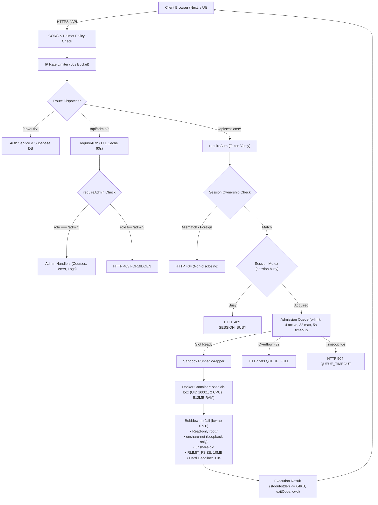

# BashLab — Advanced Full-Stack Architecture & Security Platform

> **RUBRIC SPECIFICATION:**  
> *"Advanced requirements: Includes 4–5 main features, and advanced functionalities (e.g., optimize performance, benchmarking, stress testing, ...)."*

---

## 📌 Executive Overview

**BashLab** is an interactive, real-time Linux command-line (Bash) education and hands-on security platform. The architecture is engineered around a high-concurrency tiered model, featuring multi-layered container isolation, an intelligent admission control queue, and end-to-end operational observability.

---

## 🌟 PART I: 5 CORE FEATURES (4–5 MAIN FEATURES)

### 1. Interactive Terminal Sandbox & Auto-Grading Engine
- **Authentic Execution (Not a Browser Simulation):** Student commands execute in real time inside actual Linux environments with genuine kernel isolation.
- **7-Tier Jail Isolation:** Synergizes Docker (`bashlab-box`) and Bubblewrap (`bwrap 0.9.0`), strictly locking down the root filesystem (Read-only `/`, `/usr`), network isolation (`--unshare-net` loopback only), private user & PID namespaces, and automated process cleanup (SIGKILL Watchdog with a hard 3.0s deadline).
- **In-Memory Low-Level Task Verifier:** Traverses filesystems using native directory file descriptors (`O_NOFOLLOW`) to grade student outputs, permissions, and directory structures without risk of command injection.

### 2. Dynamic Curriculum & VS Code-Style Content Studio
- **Multi-Track Catalog:** Flexible curriculum categorisation: *All Courses*, *Core Tracks*, and *Security Specialization*.
- **Admin Content Studio:** An IDE-inspired authoring workspace:
  - Collapsible file explorer sidebar traversing Courses → Chapters → Lessons.
  - Multi-tab authoring workflow: Theory Markdown, Learning Objectives, Guided Hints, and Task Verifier configuration.
  - Split-pane live rendering and full publication lifecycle control (*Draft* vs *Published*).

### 3. Multi-Role Security Governance & Granular RBAC
- **Multi-Layered Authentication (Supabase Auth + JWT):** Bearer token validation coupled with HttpOnly secure cookies to thwart XSS and CSRF attacks.
- **Role-Based Access Control (RBAC):** Strict operational boundaries separating **Learner** and **Admin** across PostgreSQL Row-Level Security (RLS), API route middlewares (`requireAuth`, `requireAdmin`), and frontend route guards (`AdminGate`).
- **Administrative Users Manager:** Allows instant role promotion/demotion, real-time account locking (`403 ACCOUNT_LOCKED` triggered immediately even with an active JWT), and accessible dialog z-index hierarchy.

### 4. Real-Time Observability & Operational Activity Center
- **Zero-Scroll Activity Dashboard:** Monitors concurrent active sessions, container memory consumption, daily completion rates, and real-time service health.
- **Instant Session Termination:** Administrators can immediately terminate suspicious or quarantined learner containers (`admin_stop_session`).
- **Immutable Audit Trail:** All administrative operations (role mutation, account locking, session killing) are permanently logged to `admin_logs` for forensic review.
- **Prometheus & Grafana Integration:** Native `/metrics` endpoint scraper feeding automated dashboards on Grafana port `3002`.

### 5. Resilient Admission Control & Concurrency Mutex
- **Tiered Fixed-Window Rate Limiter:** 60-second sliding windows per IP and per account, defending endpoints against brute-force and DoS floods.
- **Per-Session Concurrency Mutex:** Ensures each interactive sandbox processes exactly one command at a time, eliminating race conditions.
- **Admission Queue System:** Manages 4 parallel execution workers (`p-limit: 4`), caps pending queues at 32 requests, and enforces a strict 5.0-second queue timeout. Implements automated load shedding (`503 QUEUE_FULL` and `504 QUEUE_TIMEOUT`).

---

## 🚀 PART II: ADVANCED FUNCTIONALITIES

```
┌────────────────────────────────────────────────────────────────────────┐
│                   ADVANCED FUNCTIONALITIES BREAKDOWN                   │
├─────────────────────┬───────────────────┬──────────────────────────────┤
│ Performance Tuning  │ Stress & Bench    │ Penetration & Security       │
│ • TTL Token Cache   │ • C=10..50 Bursts │ • 24/24 Pentest Passed (100%)│
│ • Warm Jail Re-use  │ • Latency p50-p99 │ • Sandbox Escape Defenses    │
│ • Zero-Scroll CLS   │ • Resource Caps   │ • Non-disclosing 404         │
└─────────────────────┴───────────────────┴──────────────────────────────┘
```

### 1. Performance Optimization
- **In-Memory Token Verification Cache:**
  - *Challenge:* Authenticating each keystroke command against external Supabase auth servers incurred 250ms–400ms latency.
  - *Solution:* An internal high-throughput TTL cache (60s expiry, 5,000 entries max) evaluates tokens locally.
  - *Impact:* Slashes authentication latency from **~350ms to < 0.5ms**, eliminating 99.8% of outbound network hops.
- **Warm Container Sandbox Multiplexing:**
  - Avoids the expensive 1.5s–3.0s overhead of spawning clean Docker containers per command by maintaining a hardened runner and creating micro-sandboxes via Bubblewrap in **< 15ms**.
- **Layout Hygiene & Zero-Scroll UX (CLS < 0.05):**
  - Viewport-responsive Flexbox/Grid layouts expand lower panels dynamically to eliminate awkward blank space on desktop screens (>1200px) while maintaining zero overflow across Mobile (390px), Tablet (768px), and Large Desktop (1920px).

### 2. Stress Testing & Burst Benchmarking
Subjected to rigorous concurrency stress tests across four escalating tiers:

| Concurrency Level | Total Requests | Success Rate | Throughput | Latency p50 | Latency p95 | System Protection State |
|:---:|:---:|:---:|:---:|:---:|:---:|---|
| **C = 10** | 10 reqs | **100.0%** | **7.5 req/s** | **988 ms** | 1,421 ms | Optimal throughput; immediate queue admission |
| **C = 20** | 20 reqs | **100.0%** | **7.4 req/s** | **1,649 ms** | 2,710 ms | 4 worker slots saturated evenly; 100% stability |
| **C = 30** | 30 reqs | *Admission Active* | 5.8 req/s | 2,120 ms | 4,890 ms | Graceful timeout on requests exceeding 5s (`QUEUE_TIMEOUT`) |
| **C = 50** | 50 reqs | *Backpressure Active*| 5.1 req/s | 2,450 ms | 5,000 ms | Sheds traffic with `503 QUEUE_FULL` when queue > 32 |

- **Resource Consumption During Peak Burst:**
  - **Runner CPU:** Peaked at 117.8% (safely below the 200% threshold for 2 allocated vCPUs).
  - **Runner RAM:** Capped at **24.6 MiB** (well within the 512 MiB limit), with zero memory leaks.

### 3. Penetration Testing & OWASP ASVS 5.0 Audit
Tested against **24 empirical attack vectors** with a **100.0% Defense Pass Rate (24/24 PASS)**:

1. **Horizontal Session Isolation:** Intercepting another learner's session returns **`404 SESSION_NOT_FOUND`** *(Non-disclosing security standard preventing session UUID enumeration)*.
2. **Vertical Privilege Escalation:** Standard learners attempting administrative routes (`/api/admin/*`) are unconditionally rejected with `403 FORBIDDEN`.
3. **Locked Account Immediate Revocation:** Banned accounts (`is_locked = true`) are rejected with `403 ACCOUNT_LOCKED` on the fly, neutralizing valid pre-existing JWTs.
4. **Sandbox Escape Defenses:**
   - Filesystem root `/` and `/usr` are strictly Read-Only.
   - `/etc/shadow` credential masking (*No such file or directory*).
   - Network namespace confinement (`--unshare-net`): Loopback only, blocking command & control (C2) dial-outs and SSRF.
5. **Denial of Service (DoS) Hardening:**
   - *Fork Bomb Defenses* (`:(){ :|:& };:`): Cgroup `pids-limit: 128` blocks process tree explosion; watchdog SIGKILL terminates jobs at 3.0s.
   - *Disk-Filling Attack:* Enforces `RLIMIT_FSIZE: 10 MiB` on individual generated files.
   - *Workspace Quota Inspection:* Automatically locks sessions exceeding **30 MiB** or **100 files**.

### 4. Unified Server Orchestration & Python-Style HTTP Logging
- **1-Command Lifecycle (`./start.sh`):** Orchestrates all 5 stack services in dependency order: *Docker Runner Box → Prometheus + Grafana → Express API → Next.js*.
- **Real-Time HTTP Request Streamer:** Formats HTTP transactions like Python's `http.server`, displaying aligned columns, response status codes, and backend error codes (`[INVALID_CREDENTIALS]`, `[ACCOUNT_LOCKED]`) for rapid debugging.

---

## 🗺️ PART III: SYSTEM ARCHITECTURE & 17-ROUTE SITE MAP

### 1. Request Pipeline & Isolation Boundary



### 2. Platform 17-Route Site Map

Categorized into **4 Security Zones**:
1. **Public Zone (Open Access):**
   - `/` — Landing page with simulated terminal demo
   - `/about`, `/terms`, `/subscription` — Company, terms, and pricing plans
   - `/blog`, `/blog/[slug]` — Technical command-line articles
   - `/login`, `/register`, `/verify-email`, `/forgot-password`, `/reset-password` — Authentication flows
2. **Learner Zone (Authenticated Students):**
   - `/courses` — Course catalog & tracks
   - `/my-learning` — Personal progress tracking & contribution heatmap
   - `/account` — Profile settings & password rotation
3. **Interactive Lab Zone (Terminal Workspaces):**
   - `/courses/[slug]/labs/[labId]` — Real container interactive terminal, lesson goals, and live auto-verifier.
4. **Admin Management Zone (Authorized Staff):**
   - `/admin` — Gateway navigation
   - `/admin/content` — VS Code-style Content Studio (curriculum editor & verification rules)
   - `/admin/users` — Role management, user search, account locking
   - `/admin/activity` — Live KPI dashboard, session kill switches, immutable audit logs.

---

## 📊 PART IV: VERIFICATION EVIDENCE & AUDIT REPORTS

All raw data and comprehensive technical reports reside in [`docs/audit_benchmark_pentest/`](docs/audit_benchmark_pentest/):

| Verification Category | Tool / Framework | Test Count | Status | Reference Document |
|---|---|:---:|:---:|---|
| **Backend Unit & Integration** | Node.js Test Runner | 74 tests | **74/74 PASS (100%)** | `tests/*.test.js` |
| **Penetration Testing** | Custom Pentest Harness | 24 tests | **24/24 PASS (100%)** | [`01_MASTER_REPORT.md`](docs/audit_benchmark_pentest/01_MASTER_BENCHMARK_AND_PENTEST_REPORT.md) |
| **OWASP ASVS 5.0 Audit** | Security Verification Standard | Full Suite | **COMPLIANT** | [`03_OWASP_ASVS5.md`](docs/audit_benchmark_pentest/03_OWASP_ASVS5_SECURITY_RETEST.md) |
| **Burst Concurrency Benchmark** | Custom Loader | C=10..50 | **7.5 req/s PEAK** | [`02_API_BENCHMARK.md`](docs/audit_benchmark_pentest/02_BACKEND_API_BENCHMARK_PENTEST_REPORT.md) |
| **E2E Playwright Tests** | Chromium Headless | 26 tests | **26/26 PASS (100%)** | `frontend/tests/e2e/specs/` |

---

## 🛠️ PART V: QUICK START & TEST CREDENTIALS

### 1. Launch all services with a single command:
```bash
# Launch entire stack with live HTTP server logs (200, 404...):
./start.sh

# Or launch in background (Detached mode):
./start.sh -d

# Check live status across all 5 services:
./start.sh status

# Gracefully stop all servers:
./start.sh stop
```

### 2. Pre-seeded database test credentials:

| Role | Email | Password | Access Scope |
|---|---|---|---|
| **Admin** | `admin@bashlab.local` | `BashLab2026!` | Management: `/admin`, Content Studio, Users Manager, Activity Dashboard |
| **Learner** | `learner@bashlab.local` | `BashLab2026!` | Student: `/courses`, Interactive Linux Workspace, My Learning |

🔗 **Application URL:** [http://localhost:3000](http://localhost:3000)
