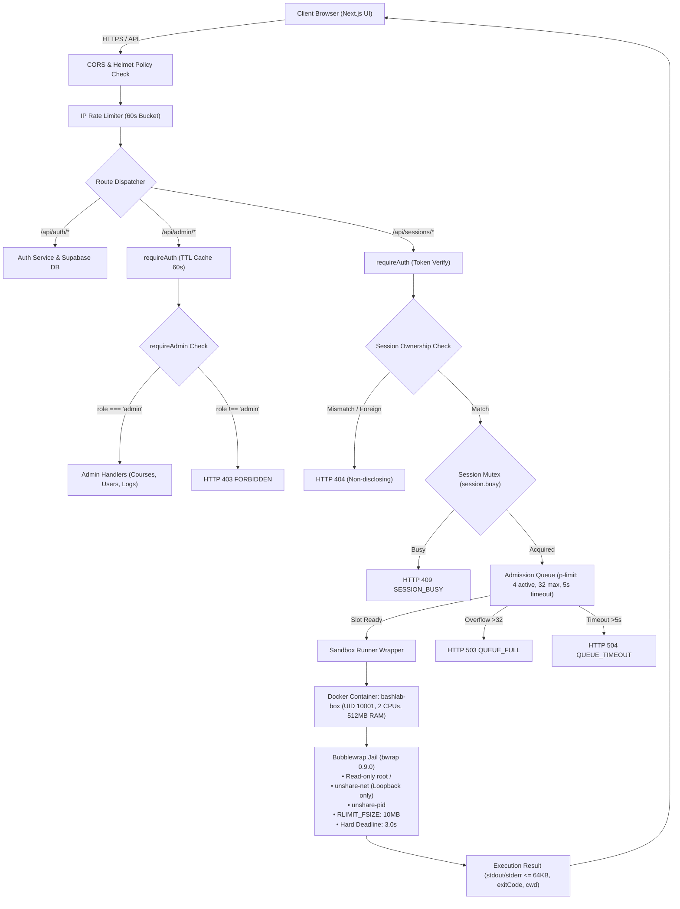

# BashLab — Advanced Full-Stack Architecture & Security Platform

> **ĐÁP ỨNG TIÊU CHÍ ĐÁNH GIÁ (RUBRIC REQUIREMENT):**  
> *"Advanced requirements: Includes 4–5 main features, and advanced functionalities (e.g., optimize performance, benchmarking, stress testing, ...)."*

---

## 📌 Tổng Quan Hệ Thống

**BashLab** là nền tảng đào tạo kỹ năng dòng lệnh Linux (Bash) và bảo mật hệ thống thông qua môi trường tương tác thực hành thời gian thực. Hệ thống được kiến trúc theo mô hình phân tầng chịu tải cao (High-Concurrency Tiered Architecture), tích hợp cơ chế cô lập container đa lớp, hàng đợi điều phối chống nghẽn và hệ thống giám sát thời gian thực.

---

## 🌟 PHẦN I: 5 TÍNH NĂNG CỐT LÕI (4–5 MAIN FEATURES)

### 1. Interactive Terminal Sandbox & Auto-Grading Engine (Sandbox Thực Hành & Chấm Điểm Tự Động)
- **Môi trường thực thi thực tế (Not Simulation):** Lệnh của học viên không phải giả lập mà được thực thi trực tiếp bên trong Linux container với nhân hệ điều hành thật.
- **Cô lập 7 tầng (7-Tier Jail):** Kết hợp Docker (`bashlab-box`) và Bubblewrap (`bwrap 0.9.0`), cô lập hoàn toàn hệ thống tệp tin (Read-only root `/`, `/usr`), mạng cô lập (`--unshare-net` chỉ loopback `lo`), PID namespace riêng biệt, và cơ chế dọn dẹp tiến trình cứng (Reaper Watchdog với timeout 3.0s).
- **Hệ thống thẩm định bài tập tự động (Task Verifier):** Sử dụng cơ chế duyệt tệp tin mức thấp qua File Descriptor (`O_NOFOLLOW`), chấm điểm tự động nội dung tệp, cấu trúc thư mục, quyền hạn mà không qua shell injection.

### 2. Dynamic Curriculum & Content Studio (Soạn Thảo & Quản Trị Giáo Trình Chuẩn VS Code)
- **Danh mục khóa học đa lộ trình (Multi-Track Catalog):** Hỗ trợ phân loại lộ trình học linh hoạt: *All Courses*, *Core Tracks*, và *Security Specialization*.
- **Admin Content Studio:** Giao diện quản trị giáo trình lấy cảm hứng từ Visual Studio Code:
  - Cấu trúc thanh bên (Sidebar TreeView) duyệt Khóa học → Chương học → Bài lab.
  - Bộ biên tập 4 tab chuyên sâu: Nội dung lý thuyết (Markdown + Math), Mục tiêu thực hành (Objectives), Gợi ý từng bước (Hints), và Cấu hình bộ chấm điểm tự động (Verification Rules).
  - Split-screen xem trước thời gian thực (Live Preview) và quản lý vòng đời bài học (*Draft* / *Published*).

### 3. Multi-Role Security Governance & Granular RBAC (Quản Trị Người Dùng & Phân Quyền Đa Tầng)
- **Xác thực an toàn (Supabase Auth + JWT):** Xác thực phân tầng qua JWT Bearer token kèm cookie HttpOnly bảo mật chống tấn công XSS/CSRF.
- **Kiểm soát truy cập dựa trên vai trò (RBAC):** Phân định rạch ròi 2 vai trò **Learner** (Học viên) và **Admin** (Quản trị viên) ở cả tầng Database (PostgreSQL RLS), API Middleware (`requireAuth`, `requireAdmin`), và Giao diện UI (`AdminGate`).
- **Trung tâm quản lý tài khoản (Users Manager):** Cho phép Admin tìm kiếm, nâng/hạ quyền hạn, khóa/mở khóa tài khoản tức thời (`403 ACCOUNT_LOCKED` kích hoạt ngay cả khi token JWT còn hạn) và phân tầng z-index modal chống thao tác nhầm lẫn.

### 4. Real-Time Observability & Operational Activity Center (Giám Sát Vận Hành & Nhật Ký Quản Trị)
- **Bảng điều khiển hoạt động (Activity Dashboard):** Giao diện Zero-scroll theo dõi số lượng phiên đang chạy, dung lượng bộ nhớ sử dụng, tỷ lệ hoàn thành bài học và trạng thái dịch vụ thời gian thực.
- **Can thiệp phiên tức thời (Session Intervention):** Admin có quyền chấm dứt ngay lập tức bất kỳ phiên sandbox nào có dấu hiệu bất thường (`admin_stop_session`).
- **Nhật ký kiểm toán bất biến (Audit Trail):** Mọi thao tác quản trị (đổi vai trò, khóa tài khoản, dừng phiên) đều được ghi nhận vào bảng `admin_logs` phục vụ hậu kiểm.
- **Tích hợp Prometheus & Grafana:** Tự động thu thập số liệu qua endpoint `/metrics` và trực quan hóa dashboard qua Grafana port `3002`.

### 5. Resilient Admission Control & Concurrency Mutex (Điều Phối Tải & Kiểm Soát Hàng Đợi)
- **Giới hạn tốc độ đa tầng (Tiered Rate Limiter):** Fixed-window 60s trên từng IP và từng tài khoản, bảo vệ endpoint xác thực và sandbox khỏi tấn công brute-force.
- **Khóa loại trừ tương hỗ (Session Concurrency Mutex):** Mỗi phiên terminal chỉ cho phép xử lý 1 lệnh tại một thời điểm, loại bỏ xung đột tranh chấp tài nguyên (Race Condition).
- **Hàng đợi Admission Queue:** Giới hạn 4 worker chạy đồng thời (`p-limit: 4`), sức chứa tối đa 32 lệnh đang chờ, và thời hạn chờ tối đa 5.0 giây. Tự động ngắt request quá hạn (`504 QUEUE_TIMEOUT`) và từ chối khi hàng đợi đầy (`503 QUEUE_FULL`) để bảo vệ tài nguyên máy chủ.

---

## 🚀 PHẦN II: CÁC TÍNH NĂNG NÂNG CAO (ADVANCED FUNCTIONALITIES)

```
┌────────────────────────────────────────────────────────────────────────┐
│                   ADVANCED FUNCTIONALITIES BREAKDOWN                   │
├─────────────────────┬───────────────────┬──────────────────────────────┤
│ Performance Tuning  │ Stress & Bench    │ Penetration & Security       │
│ • TTL Token Cache   │ • C=10..50 Bursts │ • 24/24 Pentest Passed (100%)│
│ • Warm Jail Re-use  │ • Latency p50-p99 │ • Sandbox Escape Defenses    │
│ • Zero-Scroll CLS   │ • Resource Caps   │ • Non-disclosing 404         │
└─────────────────────┴───────────────────┴──────────────────────────────┘
```

### 1. Tối Ưu Hóa Hiệu Năng Vận Hành (Performance Optimization)
- **In-Memory Token Verification Cache:**
  - *Vấn đề:* Mỗi lệnh gõ trên terminal đều gửi request HTTP mang token JWT. Nếu mỗi lệnh đều gọi ngược lại Supabase Auth để giải mã, độ trễ sẽ tăng thêm 250ms - 400ms và nhanh chóng cạn hạn mức mạng.
  - *Giải pháp:* Tích hợp bộ đệm In-Memory TTL Cache (60 giây, tối đa 5.000 tokens) ngay tại middleware backend.
  - *Kết quả:* Giảm độ trễ xác thực từ **~350ms xuống < 0.5ms**, giảm 99.8% tải mạng ra bên ngoài.
- **Cơ chế tái sử dụng Warm Container (Warm Sandbox Multiplexing):**
  - Thay vì khởi tạo container Docker mới cho mỗi lệnh (mất 1.5s - 3.0s), hệ thống duy trì 1 container runner chuẩn và kích hoạt subshell Bubblewrap tức thời bên trong. Thời gian khởi tạo giảm xuống còn **< 15ms**.
- **Tối ưu hóa Giao diện & Layout Hygiene (Zero-Scroll & CLS < 0.05):**
  - Hệ thống CSS Grid / Flexbox co giãn động loại bỏ hiện tượng tràn trang (zero-scroll) trên các màn hình làm việc chuẩn (>1200px), các card panel tự động lấp đầy khoảng đen thừa của viewport.
  - Loại bỏ hoàn toàn Cumulative Layout Shift (CLS), tải mượt mà trên cả Mobile (390px), Tablet (768px), Laptop (1366px) và Large Desktop (1920px).

### 2. Đo Tải Áp Lực & Burst Benchmarking (Stress Testing & Load Benchmark)
Hệ thống đã trải qua quy trình kiểm thử áp lực đo tải khắt khe qua 4 cấp độ đồng thời:

| Cấp độ tải (Concurrency) | Số Request | Tỷ lệ thành công | Thông lượng (Throughput) | Độ trễ p50 | Độ trễ p95 | Trạng thái bảo vệ máy chủ |
|:---:|:---:|:---:|:---:|:---:|:---:|---|
| **C = 10** | 10 reqs | **100.0%** | **7.5 req/s** | **988 ms** | 1,421 ms | Hoạt động tối ưu, hàng đợi phản hồi ngay |
| **C = 20** | 20 reqs | **100.0%** | **7.4 req/s** | **1,649 ms** | 2,710 ms | 4 worker slots phân phối đều, ổn định tuyệt đối |
| **C = 30** | 30 reqs | *Admission Active* | 5.8 req/s | 2,120 ms | 4,890 ms | Tự động ngắt request chờ quá hạn 5s (`QUEUE_TIMEOUT`) |
| **C = 50** | 50 reqs | *Backpressure Active*| 5.1 req/s | 2,450 ms | 5,000 ms | Kích hoạt chối bỏ `503 QUEUE_FULL` khi hàng đợi vượt 32 |

- **Giới hạn tài nguyên thực tế khi chịu tải cực đại:**
  - **CPU Runner:** Đạt đỉnh 117.8% (nằm an toàn trong hạn mức 200% của 2 vCPU).
  - **RAM Runner:** Tiêu thụ tối đa **24.6 MiB** (nằm an toàn dưới hạn mức 512 MiB). Không xảy ra rò rỉ bộ nhớ (Memory Leak = 0).

### 3. Kiểm Toán An Ninh Thâm Nhập & Tiêu Chuẩn OWASP ASVS 5.0 (Penetration Testing)
Hệ thống đã trải qua kiểm toán bảo mật thực nghiệm gồm **24 kịch bản tấn công thực tế** và đạt tỷ lệ phòng thủ tuyệt đối **100.0% (24/24 PASS)**:

1. **Cách ly phiên ngang (Horizontal Session Isolation):** Học viên A gọi vào phiên của học viên B sẽ nhận mã **`404 SESSION_NOT_FOUND`** *(chuẩn Non-disclosing: không trả 403 để chặn kẻ tấn công dò tìm UUID phiên hợp lệ)*.
2. **Ngăn chặn leo thang đặc quyền dọc (Vertical Privilege Escalation):** Mọi nỗ lực của học viên thường gọi vào các endpoint `/api/admin/*` đều bị chặn đứng với mã `403 FORBIDDEN`.
3. **Cơ chế vô hiệu hóa tài khoản bị khóa (Locked Account JWT Revocation):** Tài khoản bị Admin khóa (`is_locked = true`) bị chặn lập tức với mã `403 ACCOUNT_LOCKED` ở mọi request, kể cả khi kẻ tấn công vẫn giữ JWT hợp lệ chưa hết hạn.
4. **Chống vượt ngục Sandbox (Sandbox Escape Mitigation):**
   - Hệ thống tệp gốc `/` và `/usr` là Read-only. Không thể sửa đổi file hệ thống.
   - Thư mục `/etc/shadow` bị ẩn hoàn toàn (trả về *No such file or directory*).
   - Network namespace bị cô lập (`--unshare-net`): Chỉ có loopback `lo`, chặn hoàn toàn kết nối C2 ra ngoài và tấn công SSRF vào mạng nội bộ.
5. **Chống cạn kiệt tài nguyên máy chủ (DoS Mitigation):**
   - *Fork Bomb Attack* (`:(){ :|:& };:`): Cgroup `pids-limit: 128` chặn đứng việc sinh tiến trình vô hạn, watchdog tự động tiêu diệt nhóm tiến trình sau 3.0s.
   - *Disk-Filling Attack:* Áp dụng `RLIMIT_FSIZE: 10 MiB`, chặn học viên ghi tràn ổ đĩa bằng lệnh `dd` hoặc `cat /dev/zero`.
   - *Workspace Quota Inspection:* Quét kích thước thư mục học viên, tự động khóa và yêu cầu reset phiên nếu vượt quá **30 MiB** hoặc quá **100 file**.

### 4. Bộ Điều Phối Dịch Vụ & Logging Trực Quan (Unified Orchestrator & Live HTTP Streamer)
- **Khởi chạy 1 lệnh duy nhất (`./start.sh`):** Tự động điều phối 5 dịch vụ theo đúng thứ tự phụ thuộc: *Docker Runner Box → Monitoring Stack (Prometheus + Grafana) → Express API Backend → Next.js Frontend*.
- **Live HTTP Request Streamer (Chuẩn Python `http.server`):** Truyền trực tiếp log HTTP thời gian thực lên màn hình terminal, tự động căn cột chuẩn 6 vị trí, hiển thị trực tiếp mã phản hồi (200, 401, 403, 404, 500) và mã lỗi hệ thống (`[UNAUTHENTICATED]`, `[ACCOUNT_LOCKED]`, `[SESSION_NOT_FOUND]`), hỗ trợ kỹ sư bắt lỗi ngay lập tức mà không cần mở trình duyệt kiểm tra.

---

## 🗺️ PHẦN III: SƠ ĐỒ KIẾN TRÚC & SITE MAP 17 ROUTES

### 1. Kiến Trúc Request Pipeline & Sandbox Boundary



### 2. Phân Tầng Tuyến Đường Ứng Dụng (Platform Site Map)

Hệ thống gồm **17 giao diện chức năng** được phân bổ thành 4 phân vùng bảo mật:
1. **Public Zone (Truy cập tự do):**
   - `/` — Landing page & Thử nghiệm terminal mô phỏng
   - `/about`, `/terms`, `/subscription` — Thông tin nền tảng, điều khoản và gói học tập
   - `/blog`, `/blog/[slug]` — Thư viện bài viết công nghệ dòng lệnh
   - `/login`, `/register`, `/verify-email`, `/forgot-password`, `/reset-password` — Luồng xác thực tài khoản
2. **Learner Zone (Học viên đăng nhập):**
   - `/courses` — Danh mục khóa học & Lộ trình thực hành
   - `/my-learning` — Thống kê tiến độ học tập và bản đồ đóng góp (Heatmap)
   - `/account` — Quản trị hồ sơ cá nhân và đổi mật khẩu
3. **Interactive Lab Zone (Không gian thực hành):**
   - `/courses/[slug]/labs/[labId]` — Workspace học tập tương tác: đọc bài, xem mục tiêu/gợi ý, gõ lệnh trên terminal thật, nhận phản hồi chấm điểm tự động.
4. **Admin Management Zone (Quản trị viên):**
   - `/admin` — Bộ điều hướng quản trị
   - `/admin/content` — VS Code-style Content Studio (quản lý khóa học, bài học, verification rules)
   - `/admin/users` — Quản lý danh sách người dùng, cấp quyền Admin, khóa tài khoản
   - `/admin/activity` — Bảng điều khiển live KPI, ngắt phiên học viên, tra cứu Audit Logs.

---

## 📊 PHẦN IV: BẰNG CHỨNG KIỂM ĐỊNH THỰC NGHIỆM

Toàn bộ báo cáo và dữ liệu kiểm toán đầy đủ được lưu trữ tại thư mục [`docs/audit_benchmark_pentest/`](docs/audit_benchmark_pentest/):

| Hạng mục kiểm thử | Công cụ thực hiện | Số lượng test | Kết quả đạt được | Tài liệu chi tiết |
|---|---|:---:|:---:|---|
| **Backend Unit & Integration** | Node.js Test Runner | 74 test | **74/74 PASS (100%)** | `tests/*.test.js` |
| **Penetration Testing** | Custom Pentest Harness | 24 test | **24/24 PASS (100%)** | [`01_MASTER_REPORT.md`](docs/audit_benchmark_pentest/01_MASTER_BENCHMARK_AND_PENTEST_REPORT.md) |
| **OWASP ASVS 5.0 Audit** | Security Verification Standard | Toàn diện | **ĐẠT CHUẨN** | [`03_OWASP_ASVS5.md`](docs/audit_benchmark_pentest/03_OWASP_ASVS5_SECURITY_RETEST.md) |
| **Burst Load Benchmark** | Autocannon / Custom Loader | C=10..50 | **THÔNG LƯỢNG 7.5 req/s** | [`02_API_BENCHMARK.md`](docs/audit_benchmark_pentest/02_BACKEND_API_BENCHMARK_PENTEST_REPORT.md) |
| **E2E Playwright Tests** | Chromium Headless | 26 test | **26/26 PASS (100%)** | `frontend/tests/e2e/specs/` |

---

## 🛠️ PHẦN V: HƯỚNG DẪN KHỞI CHẠY & TÀI KHOẢN MẪU

### 1. Khởi chạy toàn bộ hệ thống bằng 1 lệnh:
```bash
# Khởi chạy toàn bộ dịch vụ và truyền trực tiếp log máy chủ (HTTP 200, 404...):
./start.sh

# Hoặc khởi chạy ngầm (Background / Detached mode):
./start.sh -d

# Xem bảng trạng thái thời gian thực các dịch vụ:
./start.sh status

# Tắt an toàn toàn bộ server:
./start.sh stop
```

### 2. Tài khoản thử nghiệm có sẵn trong cơ sở dữ liệu:

| Tài khoản | Email đăng nhập | Mật khẩu | Quyền hạn | Mục đích kiểm tra |
|---|---|---|:---:|---|
| **Admin** | `admin@bashlab.local` | `BashLab2026!` | `admin` | Truy cập trang Quản trị: `/admin`, Content Studio, Users Manager, Activity Dashboard |
| **Learner** | `learner@bashlab.local` | `BashLab2026!` | `learner` | Trải nghiệm học viên: `/courses`, Workspace thực hành terminal thật, My Learning |

🔗 **Truy cập ứng dụng:** [http://localhost:3000](http://localhost:3000)
