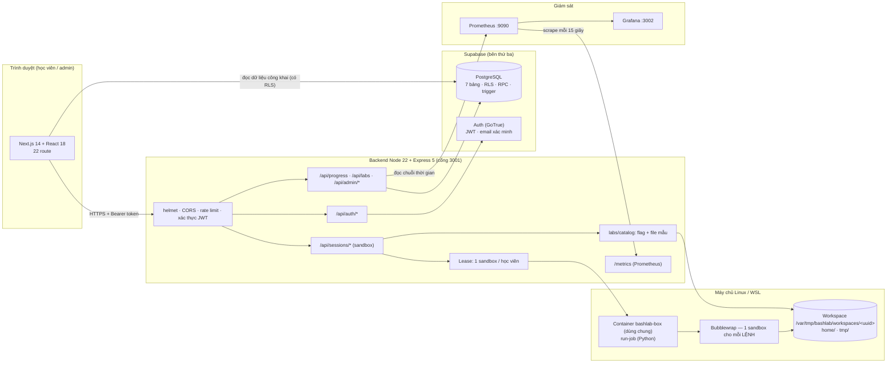
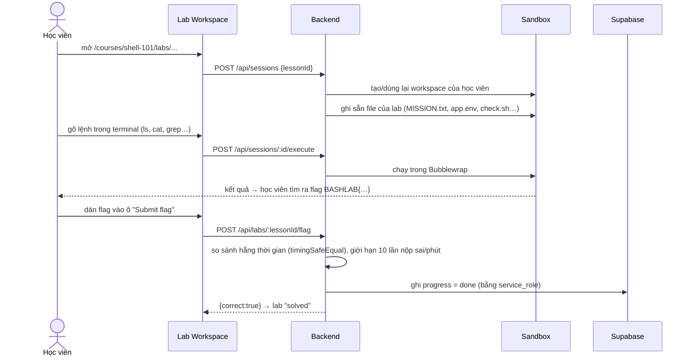

# BashLab — Kiến trúc hệ thống

> Tài liệu tổng hợp để trình bày với hội đồng. Mọi con số và tên file đều lấy từ mã nguồn hiện tại của nhánh `feature/dat-be`; phần nào chưa kiểm chứng được sẽ ghi rõ.

## 1. Bài toán và ý tưởng chính
BashLab là nền tảng **học Bash tương tác**: học viên làm lab trong một terminal ngay trên trình duyệt, lệnh chạy thật trên máy chủ, và hoàn thành lab bằng cách tìm và nộp một **flag**.

Hai vấn đề kỹ thuật cần giải:
1. **An toàn:** cho người lạ chạy lệnh Linux trên máy chủ rất nguy hiểm.
2. **Chi phí:** cấp mỗi học viên một container Docker thì nhanh hết RAM.

**Giải pháp:** *một container runner dùng chung* (`bashlab-box`) + *Bubblewrap cho từng lệnh* + *workspace riêng cho mỗi học viên trên đĩa*. Tải tăng chỉ làm tăng số tiến trình ngắn hạn, **không tăng số container** (xem [BENCHMARK.md](BENCHMARK.md): RAM runner luôn khoảng 10–16 MiB).

## 2. Sơ đồ tổng thể


## 3. Nguyên tắc thiết kế cốt lõi
| Nguyên tắc | Cách hiện thực | Vì sao |
|---|---|---|
| **Đọc qua RLS, ghi qua backend** | Trình duyệt chỉ có quyền `select` (migration 016–018 thu quyền ghi); mọi ghi đi qua API, backend kiểm tra rồi ghi bằng `service_role`. | Có lộ khoá công khai cũng không sửa được dữ liệu; mọi dữ liệu được kiểm tra ở một chỗ. |
| **Phòng thủ nhiều lớp** | GRANT (loại thao tác) + RLS (từng dòng) + kiểm tra ở backend + RPC `security definer` tự kiểm `is_admin()`. | Một lớp sót, lớp khác vẫn chặn. |
| **Không tin trình duyệt** | Flag và luật chấm chỉ nằm ở server; `done` của lab có flag chỉ ghi được khi nộp đúng flag. | Sửa giao diện hay gọi thẳng API đều không bỏ qua được. |
| **Tài nguyên có giới hạn rõ** | Hàng đợi, hạn mức workspace, timeout, giới hạn session. | Quá tải thì từ chối có kiểm soát (HTTP 429/503), không sập. |
| **Quan sát được** | `/metrics` chuẩn Prometheus, dashboard trong trang Admin. | Có số liệu để chứng minh, không phải đoán. |

## 4. Các tầng

### 4.1 Frontend (`frontend/`)
Next.js 14 (App Router), React 18. Chi tiết ở [FRONTEND.md](FRONTEND.md).

### 4.2 Backend (`backend/src/`)
Express 5, một process Node ≥ 22. Chi tiết ở [BACKEND.md](BACKEND.md).

### 4.3 Dữ liệu và đăng nhập (Supabase)
- **PostgreSQL**: 7 bảng (`profiles`, `courses`, `chapters`, `lessons`, `progress`, `practice_sessions`, `admin_logs`), 18 migration trong `backend/db/migrations/`.
- **Auth (GoTrue)**: đăng ký, đăng nhập, quên mật khẩu, **gửi email xác minh**. Backend không tự lưu mật khẩu.
- Ba vai trò truy cập: `anon` (khách), `authenticated` (đã đăng nhập, chỉ đọc), `service_role` (chỉ backend, bỏ qua RLS).

### 4.4 Sandbox (`backend/src/services/`, `backend/runner/`)
```mermaid
sequenceDiagram
  participant FE as Terminal (trình duyệt)
  participant API as API Express
  participant Q as Hàng đợi p-limit<br/>4 chạy · 32 chờ · 5 giây
  participant BOX as Container bashlab-box
  participant BW as run-job + Bubblewrap
  FE->>API: POST /api/sessions/:id/execute {command}
  API->>API: kiểm token, kiểm chủ session, khoá "đang bận", kiểm hạn mức workspace
  API->>Q: xếp lệnh
  Q->>BOX: docker exec -i bashlab-box run-job (JSON)
  BOX->>BW: dựng sandbox riêng cho đúng lệnh này
  BW-->>BOX: stdout/stderr/exitCode/cwd (hết giờ sau 3 giây)
  BOX-->>API: JSON đã kiểm schema
  API-->>FE: kết quả (đường dẫn máy chủ đã được che)
```
Cô lập từng lệnh (`backend/runner/run-job`): `--unshare-all --unshare-user --disable-userns --cap-drop ALL --clearenv`, hệ thống tệp gốc chỉ đọc (`--ro-bind /usr`, `--remount-ro /`), chỉ `home/` và `tmp/` của phiên ghi được, **không có mạng**.

Container runner (`backend/scripts/start-runner.sh`): người dùng 10001 (không root), `--read-only`, `--network none`, `--cap-drop ALL`, `no-new-privileges`, 512 MiB RAM, 2 CPU, 128 PID.

> Lưu ý trung thực: `start-runner.sh` đặt `seccomp=unconfined` và `apparmor=unconfined` mặc định (cần cho các lời gọi namespace của Bubblewrap), có biến để thay bằng profile riêng. Đây là một rủi ro còn lại, xem [PENTEST.md](PENTEST.md).

### 4.5 Giám sát (`monitoring/`)
Prometheus (cổng 9090, chỉ `127.0.0.1`) đọc `/metrics` mỗi 15 giây; Grafana (cổng 3002, chỉ xem). Trang **Admin → Activity** tự vẽ 9 biểu đồ từ Prometheus và 6 số liệu đầu trang từ DB (hiện cả khi chưa có Prometheus, kèm cảnh báo "Prometheus is not connected.").

## 5. Luồng chính: học viên làm một lab


## 6. Mô hình session: 1 học viên = 1 sandbox ("lease")
- Mỗi học viên có tối đa **một** sandbox. Mở lại **cùng lab** thì dùng lại session cũ (file đang làm còn nguyên); **đổi lab** thì workspace được reset và đặt lại file mẫu của lab mới.
- Hai yêu cầu mở lab gần như cùng lúc của một người được **xếp hàng** và nhận cùng một session (đã có test hồi quy).
- Đóng lab trả lại lease. Session không dùng quá 30 phút bị Reaper dọn (quét 5 phút/lần).
- Giới hạn toàn hệ thống: 100 lease đồng thời (`SANDBOX_MAX_ACTIVE_LEASES`).
- Lease hiện lưu **trong RAM của API**: khởi động lại API thì mất trạng thái lease (có bản lưu Supabase trong code nhưng chưa dùng).

## 7. Triển khai và cấu hình
| Thành phần | Cổng | Ghi chú |
|---|---|---|
| Frontend (Next.js) | 3000 | `npm run dev` hoặc `npm run build && npm start` |
| Backend API | 3001 | `npm run runner:start` rồi `npm start` (Linux/WSL + Docker) |
| Prometheus / Grafana | 9090 / 3002 | `docker compose up` trong `monitoring/`, chỉ nghe `127.0.0.1` |

Biến môi trường chính: `SUPABASE_URL`, `SUPABASE_ANON_KEY`, `SUPABASE_SERVICE_ROLE_KEY` (**chỉ backend**), `CORS_ORIGINS`, `SANDBOX_ENABLED`, `RATE_LIMIT_MAX`, `PROMETHEUS_URL`, `METRICS_TOKEN`, `NEXT_PUBLIC_API_URL`. Máy không có Docker chạy được toàn bộ trừ terminal thật (`SANDBOX_ENABLED=false`).

## 8. Giới hạn đã biết
- Sandbox thật cần Linux/WSL + Docker; trên máy Windows thuần không chạy.
- Phụ thuộc Supabase (bên thứ ba) cho đăng nhập và dữ liệu.
- Flag cố định mỗi lab (một người tìm ra thì chia sẻ được).
- Lab tạo mới trong Admin chưa có flag cho tới khi thêm vào `backend/src/labs/catalog.js`.
- Chưa nối cổng thanh toán thật (trang checkout là giao diện).
