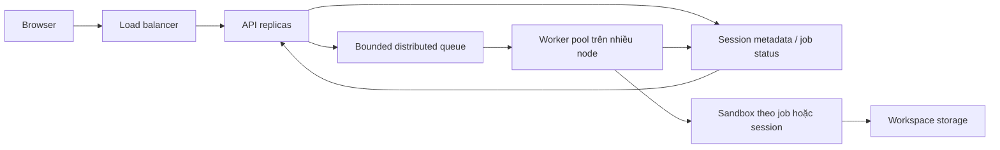

**Với cấu hình đã nêu, BashLab có thể hướng tới 1.000 người đang mở trang, nhưng chưa có cơ sở để cam kết phục vụ 1.000 người thực hành tích cực; và chắc chắn không thể chạy đồng thời 1.000 lệnh với `concurrency=4`.** Hàng đợi giúp kiểm soát quá tải, không tạo thêm năng lực xử lý.

Một lưu ý về bằng chứng: [README hiện tại](/home/light/Documents/B3/web_app/Bashlab/README.md:5) xác nhận repository mới có frontend mô phỏng, chưa có backend/sandbox thật. [Tài liệu sandbox](/home/light/Documents/B3/web_app/Bashlab/backend/sandbox_architecture_design.md:18) mô tả kiến trúc dự kiến. Vì vậy, tôi đánh giá **theo cấu hình bạn cung cấp**; các con số dưới đây là phép tính có điều kiện, không phải kết quả benchmark BashLab.

**Trước hết, “1.000 users cùng lúc” phải được chuyển thành một mô hình tải cụ thể.**

| Kịch bản | Tải thực sự lên hệ thống | Đánh giá |
|---|---|---|
| 1.000 người mở trang, chủ yếu đọc bài | Phục vụ nội dung, session, kết nối nếu có | Khả thi về mặt kiến trúc; cần đo frontend/API |
| 1.000 người, mỗi người chạy 1 lệnh/10–15 giây | Khoảng **67–100 lệnh/giây** | Khắt khe với runner hiện tại |
| 1.000 người gửi lệnh trong cùng một giây | Một đợt **burst 1.000 request** | Phải giới hạn tiếp nhận, chờ hoặc từ chối |
| 1.000 lệnh đang thực thi tại cùng một thời điểm | 1.000 job giữ tài nguyên thực thi | Cần thay đổi hoàn toàn quy mô worker và ngân sách tài nguyên |

Mở tab không nhất thiết đồng nghĩa giữ kết nối WebSocket, càng không đồng nghĩa giữ một Bash process. Nếu terminal chỉ gửi HTTP khi bấm Enter, người đang đọc bài gần như không tiêu thụ tài nguyên runner.

Ngược lại, 1.000 người **cùng gửi request** cũng chưa có nghĩa 1.000 lệnh **đang thực thi**. Scheduler có thể nhận request rồi cho chạy lần lượt. Báo cáo cần phân biệt bốn trạng thái: **connected, admitted, queued, running**.

Với Next.js, nội dung tĩnh và nội dung được cache có thể giảm đáng kể tải origin; SSR động mỗi request là một mô hình tải khác. Phải benchmark bản production, theo cách deploy thực tế. [Tài liệu triển khai Next.js 14](https://nextjs.org/docs/14/app/building-your-application/deploying).

---

**Khi 1.000 request ập tới, điểm giới hạn đầu tiên phải là admission control, trước Docker và Linux.**

Giả sử:

- `concurrency=4` là giới hạn toàn cục.
- `queue=32` nghĩa là tối đa 32 job **đang chờ**, không tính 4 job đang chạy.
- Việc kiểm tra và giữ chỗ là đúng, không có race.
- Không có tác vụ tốn tài nguyên được khởi chạy trước bước admission.

Nếu 1.000 request đến gần như tức thời, trước khi job nào hoàn thành:

| Kết quả | Số lượng |
|---|---:|
| Bắt đầu chạy | 4 |
| Được xếp hàng | 32 |
| Vượt sức chứa | **964** |

964 request vượt giới hạn nên được trả lỗi có kiểm soát: chẳng hạn `429` khi vượt quota người dùng, hoặc `503` khi toàn hệ thống hết sức chứa, kèm hướng dẫn thử lại.

**Đây là hệ thống bảo vệ tài nguyên thành công, nhưng không phải phục vụ thành công 1.000 người.** API còn sống trong khi phần lớn yêu cầu bị từ chối là một kết quả khác với đạt yêu cầu sản phẩm.

Nếu 1.000 request trải trong cả một giây, số được nhận có thể lớn hơn 36 vì slot được giải phóng:

\[
N_{\text{admitted}} \leq 36 + N_{\text{completed trong khoảng đến}}
\]

Do đó không thể khẳng định chính xác “luôn từ chối 964” cho mọi burst một giây.

Nếu mỗi job giữ slot khoảng 3 giây, 36 job được nhận cần 9 đợt:

\[
T_{\text{hoàn thành job cuối}}\approx
\left\lceil\frac{36}{4}\right\rceil\times3=27\text{ giây}
\]

Trong đó job cuối có thể chờ khoảng 24 giây trước khi bắt đầu. Đây là mô hình lý tưởng, chưa tính khởi tạo và cleanup.

Tăng queue để nhận đủ 1.000 job chỉ đổi kết quả thành:

\[
T_{\text{xả burst}}\approx
\left\lceil\frac{1000}{4}\right\rceil\times3
=750\text{ giây}=12{,}5\text{ phút}
\]

**Queue dài che việc thiếu năng lực bằng thời gian chờ.**

Timeout thực thi 3 giây cũng không phải timeout HTTP 3 giây. Cần tách deadline chờ hàng, thời gian khởi tạo, thời gian chạy và cleanup. GNU `timeout` mặc định gửi `TERM`; việc thu hồi tài nguyên cần cơ chế kết thúc cưỡng bức và xác nhận các tiến trình liên quan đã thoát. [GNU Coreutils: timeout](https://www.gnu.org/software/coreutils/manual/html_node/timeout-invocation.html).

**Tại tầng Node.js, vấn đề không phải cứ một process là chỉ phục vụ được một người.**

Express có thể điều phối nhiều request chờ I/O bằng API bất đồng bộ. Bash chạy ở tiến trình ngoài, không chạy trực tiếp trên JavaScript event loop.

Những việc dễ làm event loop nghẽn là `execSync`, filesystem đồng bộ, xử lý output lớn và công việc JavaScript nặng. Việc giữ nhiều request chờ còn tạo áp lực heap, buffer và garbage collection. [Node.js: Event Loop](https://nodejs.org/learn/asynchronous-work/dont-block-the-event-loop), [Child process](https://nodejs.org/api/child_process.html).

Đặc biệt, admission phải bao phủ cả công việc phụ. Nếu 1.000 request đều chạy quét quota rồi mới kiểm tra queue, giới hạn 4 job không bảo vệ được tầng quét filesystem.

Ngoài ra, **`concurrency=4` không phải mặc định 4 thread của libuv**. Chúng là hai cơ chế khác nhau; tăng `UV_THREADPOOL_SIZE` không tự tăng sức chứa Bash runner.

**Tại Docker, `docker exec` tiết kiệm việc tạo container mới, nhưng vẫn có chi phí khởi tạo thực thi.**

Mỗi job đi qua Docker API, runtime, tạo process, thiết lập luồng input/output và cleanup. Nếu backend gọi Docker CLI cho từng job, còn có chi phí khởi tạo CLI trên host. Docker có các bước API riêng cho tạo và bắt đầu exec. [Docker Engine API](https://docs.docker.com/reference/api/engine/version/v1.47/).

Không có cơ sở để nói “Docker socket chỉ chạy được một lệnh tại một thời điểm”, cũng không có một ngưỡng exec/giây phổ quát. Phải đo đường chạy cụ thể.

Với admission đúng, Docker chỉ nhận tối đa số job được cho chạy. Nếu quota checker hoặc task verifier tạo thêm `docker exec` ngoài giới hạn, số exec thực tế có thể vượt 4.

CPU/RAM của Docker CLI, daemon và backend thường nằm ngoài cgroup runner. **Runner 512 MiB không có nghĩa cả hệ thống chỉ cần 512 MiB.**

**Tại Linux, 128 PIDs là một giới hạn tổng rất khác với 128 người dùng.**

Một job có thể gồm tiến trình giám sát, Bubblewrap, shell và các chương trình con. PID controller còn tính cả các task/thread theo cách kernel quản lý. Vì vậy:

\[
C_{\text{PID}}\lesssim
\left\lfloor\frac{128-P_{\text{nền}}}{p_{\text{mỗi job}}}\right\rfloor
\]

Ví dụ giả định 8 task nền và 6 task/job thì trần khoảng 20 job, chưa chừa dự phòng. Đây là minh họa, không phải số process cố định của Bubblewrap. [Linux cgroup v2](https://www.kernel.org/doc/html/latest/admin-guide/cgroup-v2.html).

Các giới hạn cần phân biệt:

| Giới hạn | Phạm vi và ý nghĩa |
|---|---|
| `pids.max` | Số task trong cgroup; giới hạn 128 của runner có thể chạm trước |
| `RLIMIT_NPROC` | Giới hạn process/thread theo real UID, tùy điều kiện áp dụng |
| `threads-max`, `pid_max` | Giới hạn liên quan đến task/PID toàn hệ thống |
| `RLIMIT_NOFILE` | File descriptor của từng process: socket, pipe, file… |
| `file-max` | Giới hạn file handle toàn hệ thống |

Chạm giới hạn tạo process có thể khiến `fork` thất bại; tăng `pid_max` không sửa được giới hạn cgroup 128. Với nhiều kết nối, `nofile` của proxy, Node và daemon cũng cần kiểm tra riêng. [Linux fork(2)](https://man7.org/linux/man-pages/man2/fork.2.html), [getrlimit(2)](https://man7.org/linux/man-pages/man2/getrlimit.2.html).

Không có hằng số “Linux fork tối đa X lần/giây” áp dụng cho mọi máy. Fork đơn giản, khởi tạo shell, tạo namespace/mount và thực thi qua Docker là những phép đo khác nhau.

**CPU 2 core-equivalent và RAM 512 MiB vẫn là giới hạn chung, dù host có mạnh đến đâu.**

`--cpus=2` giới hạn ngân sách CPU của container, không nhất thiết ghim vào hai core vật lý. Một host 64 core vẫn không giúp runner vượt ngân sách này nếu cấu hình giữ nguyên. Khi vượt ngân sách, CPU bị throttling; khi vượt giới hạn bộ nhớ, có thể xảy ra OOM. [Docker resource constraints](https://docs.docker.com/engine/containers/resource_constraints).

Giới hạn tổng cũng không bảo đảm công bằng: một job dùng nhiều bộ nhớ có thể ảnh hưởng các job khác trong cùng runner.

Tuyên bố trong tài liệu rằng đưa workspace xuống SSD giúp “triệt tiêu hoàn toàn áp lực RAM” cần sửa. Dữ liệu trên SSD vẫn liên quan đến page cache, metadata cache và writeback; process cũng vẫn cần RAM. Chính xác hơn là **giảm việc giữ dữ liệu workspace trực tiếp trong tmpfs**. [Linux memory accounting](https://www.kernel.org/doc/html/latest/admin-guide/cgroup-v2.html).

**1.000 workspace không tự động gây nghẽn NVMe; hoạt động trên chúng mới quyết định tải.**

Với admission đúng, 1.000 thư mục tồn tại không đồng nghĩa 1.000 lệnh cùng đọc ghi.

Điểm đáng chú ý hơn trong [thiết kế quota](/home/light/Documents/B3/web_app/Bashlab/backend/sandbox_architecture_design.md:120) là quét dung lượng và đếm file trước/sau mỗi lệnh. Với 100 lệnh/giây và 100 file/workspace:

\[
100\times100\times2=20.000
\]

Đó là khoảng 20.000 lượt kiểm tra entry/giây nếu mỗi lượt trước/sau duyệt một lần. Nếu tính dung lượng và đếm file bằng hai lần duyệt riêng, số lượt có thể gấp đôi.

Nhưng **20.000 lượt kiểm tra entry không đồng nghĩa 20.000 physical IOPS**: cache có thể phục vụ nhiều thao tác mà không xuống SSD.

Tải thực tế phụ thuộc cache nóng/lạnh, kích thước file, metadata, đồng bộ ghi, filesystem và cleanup. Reaper quét/xóa hàng loạt có thể làm tăng độ trễ đuôi. Quota kiểm tra trước/sau cũng không phải hard quota: mức dùng thực tế có thể vượt ngưỡng trong lúc job đang chạy.

---

**Mô hình dung lượng đúng phải dùng cả thời gian chiếm slot và CPU-time, không chỉ đếm người.**

Đặt:

- \(N\): số người hoạt động.
- \(\tau\): khoảng cách trung bình giữa hai lần gửi lệnh.
- \(\lambda=N/\tau\): số lệnh đến mỗi giây.
- \(S\): thời gian trung bình một job chiếm slot, tính toàn bộ phần việc trong slot.
- \(D_r\): CPU-second/job tiêu thụ trong runner.
- \(C\): số slot; \(K_r\): ngân sách CPU của runner.

Một giới hạn thông lượng là:

\[
X\lesssim\min\left(\frac{C}{S},\frac{K_r}{D_r},
X_{\text{Docker}},X_{\text{I/O}},X_{\text{API}}\right)
\]

Các đại lượng phải đo cùng workload và cấu hình. Đặc biệt, \(S\) thường tăng khi hệ thống bị tranh chấp tài nguyên; không được lấy latency một job đơn lẻ rồi ngoại suy tuyến tính.

Với 1.000 người:

\[
\lambda=\frac{1000}{10\ldots15}
\approx67\ldots100\text{ lệnh/giây}
\]

Nếu “10–15 giây” là thời gian suy nghĩ **sau khi nhận kết quả**, mô hình kín chính xác hơn là \(X=N/(Z+R)\). Khi server chậm, thông lượng người dùng tự giảm; việc này không chứng minh hệ thống vẫn phục vụ tốt.

Với 4 slot, bảng sau cho thấy độ nhạy theo \(S\):

| \(S\) giả định | Trần theo slot \(4/S\) | Mức lập kế hoạch bằng 70% trần | Quy đổi người, 1 lệnh/10–15 giây |
|---:|---:|---:|---:|
| 50 ms | 80 lệnh/s | 56 lệnh/s | 560–840 |
| 100 ms | 40 lệnh/s | 28 lệnh/s | 280–420 |
| 250 ms | 16 lệnh/s | 11,2 lệnh/s | 112–168 |
| 3 giây | 1,33 lệnh/s | 0,93 lệnh/s | 9–14 |

Đây là **trần theo slot**, còn có thể bị CPU, RAM hoặc I/O hạ thấp. Mức 70% là giả định để chừa dư địa, không phải định luật hay bảo đảm p95.

Muốn đạt 67–100 lệnh/giây tại mức sử dụng slot 70%:

\[
S\leq\frac{0{,}7\times4}{67\ldots100}
\approx42\ldots28\text{ ms}
\]

Đồng thời, với ngân sách 2 CPU và mục tiêu sử dụng CPU 70%:

\[
D_r\leq\frac{0{,}7\times2}{67\ldots100}
\approx21\ldots14\text{ CPU-ms/job}
\]

**Cấu hình hiện tại chỉ có cơ hội đạt mục tiêu nếu cả hai điều kiện khắt khe này được đáp ứng**, cùng với các giới hạn còn lại.

Đuôi phân bố cũng rất quan trọng. Nếu 95% job giữ slot 50 ms nhưng 5% giữ slot 3 giây:

\[
E[S]=0{,}95\times0{,}05+0{,}05\times3=0{,}1975\text{ s}
\]

Trần theo 4 slot chỉ còn khoảng **20,3 lệnh/giây**. Benchmark chỉ dùng lệnh cực ngắn sẽ bỏ sót hiện tượng này.

**Không thể trả lời “một core chạy được bao nhiêu bwrap/bash mỗi giây” bằng một con số cố định.**

Cách trả lời có thể kiểm chứng là đo \(D\), tổng CPU-second cho một job trên đường thực thi được xét:

\[
X_{\text{CPU,1 core}}\leq\frac{1}{D}
\]

| CPU-time đo được mỗi job | Trần CPU lý tưởng một core | Ngân sách tại 70% CPU |
|---:|---:|---:|
| 5 ms | 200 job/s | 140 job/s |
| 20 ms | 50 job/s | 35 job/s |
| 50 ms | 20 job/s | 14 job/s |
| 100 ms | 10 job/s | 7 job/s |

**Bảng này là phép quy đổi, không phải benchmark Bubblewrap.** Một job có wall-time 100 ms có thể chỉ dùng 5 ms CPU nếu chủ yếu chờ I/O. Ngược lại, pipeline nhiều process có thể tiêu thụ CPU trên nhiều core.

**Một server phục vụ 1.000 người thực hành ở mức 67–100 lệnh/giây là mục tiêu khả thi có điều kiện.**

Nếu \(D_{\text{host}}\) bao gồm CPU của toàn đường thực thi trên host:

\[
K_{\text{jobs}}\geq\frac{\lambda D_{\text{host}}}{0{,}7}
\]

| \(D_{\text{host}}\) giả định | Core-equivalent cho 67–100 lệnh/s | Cấu hình khởi điểm để thử nghiệm |
|---:|---:|---|
| 20 CPU-ms/job | 1,9–2,9 | 8 core, RAM 16–32 GiB |
| 50 CPU-ms/job | 4,8–7,2 | 12–16 core, RAM khoảng 32 GiB |
| 100 CPU-ms/job | 9,5–14,3 | Khoảng 24 core, RAM 32–64 GiB |

Cột phần cứng là **ngân sách thử nghiệm**, có dư địa cho dịch vụ nền; không phải cam kết mua máy là đạt tải. Core vật lý, SMT thread và vCPU chia sẻ không có hiệu năng tương đương.

Số slot phải tăng tương ứng. Chẳng hạn tại 100 lệnh/giây:

- Nếu \(S=100\) ms, cần khoảng \(100\times0{,}1/0{,}7\approx15\) slot.
- Nếu \(S=250\) ms, cần khoảng 36 slot.

Tăng slot đòi hỏi tăng hoặc phân chia lại ngân sách runner, không chỉ đổi một biến cấu hình.

RAM nên tính từ tập job đang chạy:

\[
M\approx M_{\text{dịch vụ}}
+C\times m_{\text{job}}
+M_{\text{cache/buffer}}
+\text{dự phòng}
\]

Ví dụ giả định 32–64 job cùng chạy, mỗi job đóng góp 20–50 MiB, phần job chiếm khoảng **0,6–3,1 GiB**. Đo mức sử dụng cgroup dưới tải hữu ích hơn cộng RSS một cách máy móc vì có trang nhớ dùng chung.

Với storage:

- 1.000 workspace × 30 MiB ≈ **29,3 GiB dữ liệu**, chưa tính overhead và dự phòng.
- Nếu mỗi job gây 20–200 thao tác I/O vật lý thực sự, 100 job/s tạo **2.000–20.000 IOPS**.
- Nếu mỗi job chuyển 1 MiB dữ liệu xuống/lên đĩa, cần khoảng **100 MiB/s**.

Hai con số cuối là ví dụ đầu vào cho phép tính. Cần đo IOPS và latency theo workload filesystem thực tế, không dùng thông số quảng cáo SSD làm bằng chứng. `fio` cho phép kiểm soát block size, I/O depth và kiểu truy cập để đo phần thiết bị. [Tài liệu fio](https://fio.readthedocs.io/en/latest/fio_doc.html).

---

**Muốn phục vụ 1.000 lệnh đang chạy, trước tiên phải nói mỗi lệnh được hưởng bao nhiêu tài nguyên.**

Có ba trường hợp rất khác nhau:

| Bản chất 1.000 job đang chạy | Hệ quả |
|---|---|
| Chủ yếu chờ I/O | Có thể dùng ít CPU, nhưng cần RAM, PID, FD và năng lực storage |
| Mỗi job trung bình dùng 0,1 core | Tổng khoảng 100 core-equivalent; khoảng 143 nếu dành 30% dư địa |
| Mỗi job CPU-bound và cần hiệu năng tương đương một core | Cần khoảng 1.000 core-equivalent cho payload |

Một máy ít core vẫn có thể chứa nhiều process và chia thời gian CPU cho chúng. Nhưng **“process tồn tại đồng thời” không bảo đảm “hoàn thành đúng hạn”**.

Ví dụ 1.000 job, mỗi job cần 100 CPU-ms, tổng công việc là 100 CPU-second. Runner 2 CPU cần tối thiểu:

\[
T\geq100/2=50\text{ giây}
\]

Đây mới là giới hạn CPU lý tưởng, chưa tính overhead. Không thể hoàn thành tất cả trong 3 giây với ngân sách đó.

Nếu mỗi job đóng góp 32–64 MiB bộ nhớ, 1.000 job cần khoảng **31–63 GiB cho payload** trước khi tính dịch vụ và dự phòng. Lệnh có nhu cầu bộ nhớ cao hơn sẽ thay đổi hoàn toàn phép tính.

Nếu mục tiêu thực ra là “nhận burst 1.000 request và trả hết trong vài giây”, đó là bài toán khác: có thể dùng ít hơn 1.000 slot và chia thành nhiều đợt. Cần chốt deadline sản phẩm trước khi chọn kiến trúc.

**Kiến trúc production nên tách tiếp nhận request khỏi thực thi lệnh, đồng thời giữ rõ quyền sở hữu workspace.**

Các thay đổi cần thiết:

1. **API có thể nhân bản.** Session metadata không chỉ nằm trong `Map` của một process. Request được kiểm tra quota và admission trước khi tạo việc tốn tài nguyên. API trả job ID và trạng thái; kết quả qua polling có giới hạn, SSE hoặc WebSocket.

2. **Một hàng đợi có giới hạn.** Có thể chọn BullMQ trên Redis hoặc RabbitMQ theo nhu cầu vận hành. Redis là nền lưu trữ của BullMQ, không phải một tên thay thế tương đương hoàn toàn. Queue cần deadline, quota người dùng và giới hạn tổng; không nhận vô hạn chỉ vì còn RAM.

3. **Worker pool có ngân sách tài nguyên.** Mỗi node có số slot đo được, cùng giới hạn CPU/RAM/PIDs. Runner agent sống lâu có thể giảm chi phí gọi Docker CLI mỗi lệnh; hiệu quả vẫn phải benchmark.

4. **Cô lập tài nguyên theo job/session.** Giới hạn tổng một container chưa đủ bảo đảm công bằng. Cần kiểm soát tài nguyên của từng nhóm thực thi, output và vòng đời tiến trình. Output cap phải được áp dụng trong quá trình thu nhận, không chỉ cắt chuỗi trước khi gửi về browser.

5. **Tuần tự hóa trong cùng session.** Hai lệnh cùng sửa workspace hoặc cập nhật CWD không nên chạy tùy ý song song. Đặc biệt thiết kế hiện tại dùng chung file `__new_cwd` theo session. Có thể chạy song song giữa nhiều session, nhưng giữ thứ tự trong từng session.

6. **Tách trạng thái điều phối khỏi dữ liệu workspace.** Worker dùng local SSD phải có session affinity và ánh xạ session → node. Nó không hoàn toàn stateless nếu giữ bản duy nhất của workspace.

7. **Quy định rõ retry và trạng thái không chắc chắn.** Lệnh Bash sửa file có thể không idempotent. Nếu worker chết sau khi sửa file nhưng trước khi ghi nhận kết quả, tự động chạy lại có thể tạo hiệu ứng hai lần. Job ID chống nhận trùng là cần thiết nhưng chưa giải quyết mọi trường hợp này. BullMQ cũng yêu cầu thiết kế idempotence khi tận dụng retry. [BullMQ: Idempotent jobs](https://docs.bullmq.io/patterns/idempotent-jobs).

8. **Dự phòng năng lực trước burst.** Autoscaling thường không kịp cứu một đợt đến đồng thời trong một giây. Phải có worker sẵn, hoặc chấp nhận thời gian chờ đã công bố.

Lựa chọn storage nên gắn với yêu cầu sản phẩm:

| Phương án | Ưu điểm | Đánh đổi |
|---|---|---|
| Local SSD + session affinity | Đường I/O ngắn, phù hợp tương tác shell | Node hỏng cần phục hồi hoặc reset session |
| Shared filesystem | Workspace có thể được truy cập từ nhiều node | Metadata latency, contention, locking và vận hành phức tạp hơn |
| Workspace tạm thời + checkpoint | Dễ tái tạo runner, phù hợp bài học có thể reset | Phải công bố phần thay đổi có thể mất giữa hai checkpoint |

Object storage phù hợp lưu checkpoint hoặc artifact; không mặc nhiên thay thế filesystem POSIX đang phục vụ Bash.

Với BashLab, hướng triển khai hợp lý là **đo và tối ưu một node trước, rồi mở rộng worker theo session**. Không cần đưa toàn bộ hệ thống phân tán vào đồ án ngay từ đầu, nhưng phải thiết kế để không phụ thuộc cứng vào một runner và một `Map` trong RAM.

---

**Bằng chứng thuyết phục hội đồng nên là một đường cong tải, không phải một con số users đứng riêng.**

Một kế hoạch kiểm chứng tối thiểu:

| Thử nghiệm | Điều cần chứng minh |
|---|---|
| 1.000 phiên đọc bài/kết nối | Frontend/API có ổn định và đủ bộ nhớ không |
| 67 rồi 100 lệnh/s với workload đại diện | Đạt thông lượng và latency mong muốn không |
| Burst 1.000 request | Bao nhiêu được nhận, từ chối, hoàn thành; phục hồi mất bao lâu |
| Chạy đủ lâu qua các chu kỳ cleanup | Có leak, queue tích tụ hoặc suy giảm theo thời gian không |

Workload nên có lệnh ngắn, pipeline thông thường, thao tác file nhỏ và một tỷ lệ job gần timeout. Chỉ chạy một lệnh tối giản không đại diện cho thực hành Bash.

Các chỉ số cần báo cáo:

- Offered, admitted và completed throughput; tỷ lệ từ chối và lỗi.
- Queue wait, startup time, execution time; p50/p95/p99 end-to-end.
- Event-loop lag, CPU throttling, bộ nhớ, OOM và số task.
- I/O latency, queue depth thiết bị và tải do cleanup.
- Thời gian hệ thống trở lại bình thường sau burst.

Có thể đặt **SLO thử nghiệm**, chẳng hạn 99% lệnh hợp lệ được nhận và p95 dưới 500 ms cho một tập bài học xác định. Đây là mục tiêu để kiểm tra, không phải kết quả hiện có.

Bài thử ở tốc độ đến cố định cũng rất quan trọng: nếu công cụ chỉ gửi request tiếp theo sau khi request trước hoàn tất, server càng chậm thì tải sinh ra càng thấp, dễ che mất điểm bão hòa.

**Câu trả lời trước hội đồng nên trực tiếp thừa nhận giới hạn rồi đưa ra cách đo.**

> “Thưa thầy/cô, em phân biệt 1.000 người đang mở hệ thống với 1.000 người cùng thực thi lệnh.
>
> Với người chủ yếu đọc bài, kiến trúc có khả năng phục vụ quy mô đó, nhưng em chỉ khẳng định sau khi có số liệu kiểm thử.
>
> Với thực thi, cấu hình hiện tại giới hạn 4 lệnh chạy và 32 lệnh chờ. Nếu 1.000 yêu cầu đến đồng thời, hệ thống sẽ từ chối phần vượt sức chứa để giữ ổn định; em không khẳng định phục vụ thành công cả 1.000 yêu cầu.
>
> Nếu mỗi người chạy một lệnh mỗi 10–15 giây, tải mục tiêu là khoảng 67–100 lệnh mỗi giây. Em cần đo thời gian xử lý, tài nguyên mỗi lệnh và độ trễ p95 để xác định phần cứng. Khi cần mở rộng, em phân phối công việc sang nhiều worker và quản lý workspace theo session.
>
> Vì vậy, em sẽ công bố năng lực theo workload, tỷ lệ thành công và thời gian phản hồi, thay vì chỉ nói một con số người dùng.”

Nếu bị hỏi “vậy đồ án hiện tại chịu được bao nhiêu?”, câu trả lời chính xác với repository này là: **“Hiện em mới xác định được giới hạn thiết kế; chưa có benchmark backend để công bố sức chứa người dùng.”** Điểm thể hiện năng lực nằm ở việc giải thích được giới hạn ấy và chứng minh được bước nâng cấp tiếp theo.