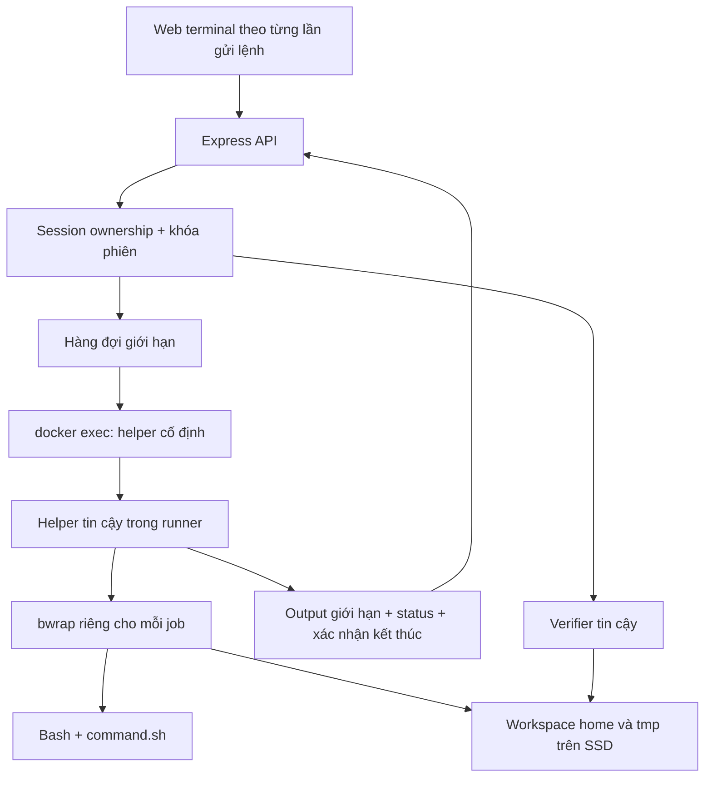

**Kiến trúc một Docker Runner dùng chung + bubblewrap cho từng lệnh phù hợp với BashLab**, nếu định vị đây là môi trường học Bash có giới hạn rõ ràng. Tôi khuyến nghị giữ hướng này, nhưng sửa cơ chế thu hồi tiến trình, CWD tracker và cách diễn đạt về quota/RAM trước khi triển khai.

Tôi đã đọc [thiết kế sandbox hiện tại](/home/light/Documents/B3/web_app/Bashlab/backend/sandbox_architecture_design.md). Repository hiện mới có tài liệu backend. Máy đang truy cập có Docker `28.5.2`, bubblewrap `0.12.0`, nhưng chạy kernel `7.1.5+kali-amd64` và Docker rootless, khác môi trường Ubuntu trong đề bài. Vì vậy, các cấu hình bảo mật dưới đây là cấu hình tham chiếu cần kiểm tra trên VPS đích; tôi chưa xác nhận toàn bộ Docker + AppArmor chạy thành công tại đó.

Các mẫu CWD wrapper và verifier đã được kiểm tra riêng bằng những ca thử hữu hạn, trình bày bên dưới.

**1. Những quyết định kiến trúc nên giữ và những giả định cần sửa.**

| Thành phần | Đánh giá | Điều chỉnh đề xuất |
|---|---|---|
| Một runner dùng chung | Phù hợp đồ án | Chấp nhận một lỗi OOM có thể ảnh hưởng nhiều phiên |
| Một bwrap cho mỗi lệnh | Phù hợp thực thi stateless | Bắt buộc cách ly PID, mount, network, IPC và user namespace |
| Workspace trên SSD | Hợp lý | Không gọi là “triệt tiêu hoàn toàn áp lực RAM” |
| CWD trong `Map` | Đủ cho một API process | CWD là metadata không đáng tin, phải kiểm tra khi dùng |
| Quota trước/sau | Hữu ích cho trải nghiệm | Không phải giới hạn cưỡng chế trong lúc lệnh chạy |
| Timeout 3 giây | Hợp lý với bài Bash nhỏ | Timer thực thi phải nằm trong runner |
| Reaper 5 phút / TTL 30 phút | Hợp lý | Phải dùng chung cơ chế khóa với execute, verify và reset |
| Verifier bên ngoài shell | Đúng hướng | Đọc dữ liệu bằng API filesystem; không thực thi file của học viên |

Hai điểm cần bảo vệ bằng lập luận chính xác:

- **Nhiều container không đồng nghĩa mỗi container có một bản Ubuntu chiếm RAM riêng.** Image layers được chia sẻ; RAM phụ thuộc tiến trình, cache và workload. Lợi ích của thiết kế hiện tại là giảm số đối tượng runtime và không duy trì shell cho mỗi phiên.
- **SSD vẫn sử dụng RAM.** Buffered I/O sử dụng page cache; cgroup memory accounting bao gồm cả những loại bộ nhớ liên quan filesystem. Chuyển workspace khỏi tmpfs giúp dữ liệu có backing store trên đĩa, không biến chi phí RAM thành bằng không. [Tài liệu cgroup v2](https://docs.kernel.org/7.1/admin-guide/cgroup-v2.html)

Kiến trúc tôi đề xuất:



Helper là một chương trình nhỏ nằm ngoài bwrap nhưng bên trong container, chịu trách nhiệm tạo sandbox, giới hạn output, timeout và thu hồi tiến trình. Nó không cần trở thành một dịch vụ mạng.

---

**2. Bwrap-in-Docker: ưu tiên user namespace, không mặc định cấp `SYS_ADMIN`.**

Lỗi tạo namespace có thể đến từ nhiều lớp độc lập:

| Lớp | Nguyên nhân thường gặp |
|---|---|
| Kernel | Không hỗ trợ hoặc hạn chế unprivileged user namespaces |
| Namespace limits | Hết hạn mức namespace hoặc quá sâu |
| Docker seccomp | Chặn namespace/mount syscalls cần cho bwrap |
| AppArmor | Chặn tạo user namespace, mount hoặc các thao tác setup |
| UID/GID mapping | Quyền workspace không khớp với user trong container |

**Cấp `--cap-add=SYS_ADMIN` không phải lời giải đầy đủ và cũng không phải lựa chọn đầu tiên.**

Capability này rất rộng. Hơn nữa, Docker seccomp có các quy tắc thay đổi theo capability được cấp; AppArmor vẫn là một lớp kiểm tra độc lập. Thêm capability có thể vừa mở thêm bề mặt syscall, vừa không giải quyết được lỗi AppArmor. [Docker seccomp](https://docs.docker.com/engine/security/seccomp/)

Cấu hình ưu tiên:

1. Docker rootless nếu máy đích đã vận hành ổn định với nó.
2. User không phải root trong runner.
3. `--cap-drop=ALL`.
4. `no-new-privileges`.
5. Seccomp được điều chỉnh cho thao tác setup của bwrap.
6. AppArmor profile riêng cho runner.
7. Sandbox con không giữ capability và không được tạo thêm user namespace.

Rootless Docker và user namespace của bwrap là hai lớp khác nhau; rootless không tự động bỏ các hạn chế seccomp/AppArmor. [Docker rootless](https://docs.docker.com/engine/security/rootless/)

Lệnh chạy runner tham chiếu:

```bash
docker run -d \
  --name bashlab-box \
  --init \
  --restart unless-stopped \
  --user 10001:10001 \
  --read-only \
  --network none \
  --cap-drop ALL \
  --security-opt no-new-privileges=true \
  --security-opt seccomp=/etc/bashlab/seccomp-bwrap.json \
  --security-opt apparmor=bashlab-bwrap \
  --memory 512m \
  --memory-swap 512m \
  --cpus 2 \
  --pids-limit 128 \
  --ulimit nofile=256:256 \
  --ulimit core=0:0 \
  --tmpfs /tmp:rw,nosuid,nodev,size=8m,mode=1777 \
  --mount type=bind,src=/var/tmp/bashlab/workspaces,dst=/workspaces \
  --mount type=bind,src=/var/tmp/bashlab/control,dst=/control,readonly \
  bashlab-runner:0.12.0 \
  sleep infinity
```

Các điều kiện đi kèm:

- Image phải thực sự chứa bwrap `0.12.0`, Bash và công cụ bài học. Phiên bản bwrap trên host không xác định phiên bản trong image.
- Không chép trực tiếp binary từ Kali vào Ubuntu rồi giả định tương thích thư viện.
- `/control` chứa request files do backend tạo; chỉ bind riêng file cần thiết vào sandbox.
- Với rootless/userns-remap, chuẩn bị ownership theo mapping thực tế; không mặc định `chown 10001` trên host là đủ.
- Không mount Docker socket vào runner.
- `--memory-swap=512m` cùng `--memory=512m` yêu cầu không cấp thêm swap cho container, khi host hỗ trợ enforcement tương ứng. [Docker resource constraints](https://docs.docker.com/engine/containers/resource_constraints/)

Tmpfs 8 MiB ở đây phục vụ setup bên ngoài sandbox. `/tmp` học viên vẫn bind từ SSD. Hai đường dẫn này có cùng tên trong các mount namespace khác nhau.

**Seccomp cần mở có chủ đích.** Với baseline upstream Docker `28.5.2`, có thể tạo bản điều chỉnh như sau:

```python
# make-seccomp.py
import json
import pathlib
import urllib.request

url = (
    "https://raw.githubusercontent.com/moby/moby/v28.5.2/"
    "vendor/github.com/moby/profiles/seccomp/default.json"
)

with urllib.request.urlopen(url) as response:
    profile = json.load(response)

profile["syscalls"].append({
    "names": [
        "clone",
        "unshare",
        "mount",
        "umount2",
        "pivot_root",
        "sethostname",
        "setns",
    ],
    "action": "SCMP_ACT_ALLOW",
})

pathlib.Path("seccomp-bwrap.json").write_text(
    json.dumps(profile, indent=2) + "\n"
)
```

Đây là **baseline để kiểm thử tích hợp**, chưa phải policy tối thiểu đã audit. Nó mở các syscall nêu trên cho container; kernel vẫn kiểm tra capability và namespace ownership. Giữ nguyên cách xử lý `clone3` của baseline, không tùy tiện đổi mọi lỗi thành cho phép.

Với bản Docker do distro đóng gói, cần đối chiếu cả các bản vá của distro. Khi nâng Docker, phải cập nhật baseline thay vì giữ profile cũ vô thời hạn. [Profile upstream đúng phiên bản](https://raw.githubusercontent.com/moby/moby/v28.5.2/vendor/github.com/moby/profiles/seccomp/default.json)

**AppArmor cũng cần cấu hình tương ứng.** Profile Docker upstream có quy tắc `deny mount`; thêm một dòng `mount,` bên cạnh không ghi đè được explicit deny. Ngoài ra, `--disable-userns` cần thao tác với giới hạn user namespace, nên phải xem cả quy tắc đối với `/proc/sys/user/`. [Template AppArmor Docker 28.5.2](https://raw.githubusercontent.com/moby/moby/v28.5.2/vendor/github.com/moby/profiles/apparmor/template.go)

Ví dụ profile khởi đầu cho Ubuntu có hỗ trợ rule `userns`:

```text
#include <tunables/global>

profile bashlab-bwrap flags=(attach_disconnected,mediate_deleted) {
  #include <abstractions/base>

  file,
  network,
  capability,
  userns,

  mount,
  umount,
  pivot_root,

  signal,
  ptrace (read,readby) peer=bashlab-bwrap,

  deny /sys/** wklx,
  deny /proc/sysrq-trigger rwklx,
  deny /proc/kcore rwklx,

  deny /proc/sys/kernel/** w,
  deny /proc/sys/net/** w,
  deny /proc/sys/fs/** w,
  deny /proc/sys/vm/** w,
}
```

Profile này cố ý tương đối rộng ở bước setup. `capability,` trong AppArmor **không tự cấp** Linux capabilities đã bị Docker loại bỏ, nhưng cho phép kiểm tra LSM đối với capability có trong namespace con.

Không nên giới thiệu profile này là “hardened production policy”. Muốn đạt mức đó cần thu hẹp theo audit log của image và kernel cụ thể. Trên Ubuntu, hạn chế unprivileged user namespaces cũng cần được xét riêng; không nên chữa bằng cách tắt bảo vệ toàn host. [Ubuntu 24.04 release notes](https://documentation.ubuntu.com/release-notes/24.04/)

Nếu yêu cầu là **giữ nguyên hoàn toàn Docker default seccomp/AppArmor**, bwrap-in-Docker có thể không phù hợp. Khi ấy hai phương án thực tế là bwrap trực tiếp dưới một host worker riêng hoặc một pool container nhỏ. Với scope đã chọn, tôi ưu tiên profile riêng thay vì chuyển sang `--privileged`.

---

**3. Sandbox con phải chỉ nhìn thấy dữ liệu của đúng một phiên.**

Cấu hình tham chiếu sau dành cho Ubuntu amd64 với merged `/usr`. Những biến `BL_*` phải do helper lấy từ session/job đã xác thực, không nhận đường dẫn tùy ý từ client.

```bash
/usr/bin/bwrap \
  --unshare-user \
  --unshare-pid \
  --unshare-net \
  --unshare-ipc \
  --unshare-uts \
  --disable-userns \
  --assert-userns-disabled \
  --uid 10001 \
  --gid 10001 \
  --cap-drop ALL \
  --die-with-parent \
  --new-session \
  --clearenv \
  --setenv HOME /home/student \
  --setenv USER student \
  --setenv LOGNAME student \
  --setenv PATH /usr/bin:/bin \
  --setenv LANG C.UTF-8 \
  --setenv LC_ALL C.UTF-8 \
  --setenv TERM dumb \
  --ro-bind /usr /usr \
  --symlink usr/bin /bin \
  --symlink usr/sbin /sbin \
  --symlink usr/lib /lib \
  --symlink usr/lib64 /lib64 \
  --ro-bind /opt/bashlab/etc/passwd /etc/passwd \
  --ro-bind /opt/bashlab/etc/group /etc/group \
  --proc /proc \
  --dev /dev \
  --ro-bind /opt/bashlab/empty /dev/shm \
  --bind "$BL_WORKSPACE/home" /home/student \
  --bind "$BL_WORKSPACE/tmp" /tmp \
  --ro-bind /opt/bashlab/wrap.sh /run/wrap.sh \
  --ro-bind "$BL_COMMAND_FILE" /run/command.sh \
  --remount-ro /dev \
  --remount-ro / \
  --chdir "$BL_CWD" \
  --sync-fd 4 \
  --json-status-fd 5 \
  /bin/bash --noprofile --norc /run/wrap.sh /run/command.sh
```

Helper phải tạo các FD trước khi chạy:

| FD | Mục đích |
|---|---|
| 0 | `/dev/null` cho Bash học viên |
| 1 | stdout học viên |
| 2 | stderr và chẩn đoán thực thi cần phân loại |
| 3 | CWD metadata từ wrapper |
| 4 | Theo dõi vòng đời sandbox qua `--sync-fd` |
| 5 | Status từ chính bwrap |

Các điểm quan trọng:

- Không bind toàn bộ `/workspaces` hoặc `/control` vào sandbox con.
- Không bind root filesystem bằng `--ro-bind / /`.
- Chỉ có `home/` và `tmp/` là các vùng dữ liệu được phép ghi trong cấu hình này.
- Root filesystem của bwrap vẫn sử dụng tmpfs nhỏ cho cấu trúc mount. Remount root read-only ngăn học viên tạo dữ liệu ở những vị trí ngoài workspace.
- `/dev/shm` được để read-only vì scope hiện tại không cần writable shared memory.
- Dùng namespace bắt buộc tường minh; không chấp nhận âm thầm bỏ qua một namespace quan trọng.

`--disable-userns` ngăn tạo thêm user namespaces bên trong, còn `--sync-fd` hỗ trợ theo dõi vòng đời từ bên ngoài. Bubblewrap là công cụ xây dựng sandbox; độ cách ly phụ thuộc cấu hình do ứng dụng chọn. [Manual bwrap 0.12.0](https://raw.githubusercontent.com/containers/bubblewrap/v0.12.0/bwrap.xml), [Bubblewrap security model](https://github.com/containers/bubblewrap/blob/v0.12.0/README.md)

---

**4. CWD tracker: giữ đúng hành vi Bash phổ biến, nhưng không hứa bảo đảm tuyệt đối.**

Wrapper hiện tại dạng:

```bash
COMMAND; rc=$?; pwd > /tmp/cwd; exit "$rc"
```

có ba vấn đề:

- `exit` có thể làm phần cuối không chạy.
- Lỗi parse có thể làm cả cấu trúc wrapper không thực thi như dự kiến.
- File metadata trong `/tmp` thuộc vùng học viên được phép sửa.

Cách phù hợp hơn:

1. Ghi nguyên nội dung lệnh vào `command.sh` riêng, read-only trong sandbox.
2. Cài `EXIT` trap trong wrapper trước khi đọc file.
3. Gửi CWD qua FD riêng, phân tách bằng NUL.
4. Lấy exit status từ tiến trình/bwrap, không lấy từ metadata do Bash ghi.
5. Không nối metadata vào stdout hoặc stderr.

Mẫu `wrap.sh`:

```bash
#!/usr/bin/env bash

__bl_finish() {
  local rc="$?" raw cwd

  builtin trap - EXIT
  set +e +u

  # Sentinel giữ nguyên newline có thể tồn tại ở cuối tên thư mục.
  if raw=$(builtin pwd -P 2>/dev/null && builtin printf '\001'); then
    cwd=${raw%$'\n\001'}
    builtin printf '%s\0' "$cwd" >&3
  fi

  builtin exit "$rc"
}

builtin trap __bl_finish EXIT

# File riêng tránh ghép cú pháp học viên vào cú pháp wrapper.
builtin source -- "$1"

builtin exit "$?"
```

Mẫu này đã vượt qua tám ca kiểm tra cục bộ:

| Ca | Kết quả |
|---|---|
| Lệnh thường | Output và exit status đúng |
| Pipeline | Output và exit status đúng |
| `cd` rồi `exit 1` | Giữ CWD mới, trả `1` |
| `cd` rồi lỗi cú pháp | Giữ CWD đã thay đổi, trả `2` |
| stdout và stderr cùng có dữ liệu | Tách biệt |
| Lệnh `read` với stdin đóng | Nhận EOF |
| `set -e` rồi lệnh lỗi | Giữ exit status và CWD |
| Tên thư mục chứa newline | Metadata giữ nguyên tên |

Bash thực thi `EXIT` trap khi thoát theo các trường hợp thông thường, nhưng một script có thể đã thực hiện một phần trước khi gặp lỗi cú pháp phía sau. Không nên tuyên bố “syntax error thì không thay đổi filesystem”. [Bash builtins](https://www.gnu.org/s/bash/manual/html_node/Bourne-Shell-Builtins.html)

**Giới hạn bắt buộc công bố:** shell thực thi tùy ý có thể thay trap, đóng FD metadata, thay thế chính nó bằng chương trình khác hoặc bị kill trước khi gửi CWD. Vì vậy không có wrapper Bash ngắn nào bảo đảm CWD chính xác cho mọi chương trình tùy ý.

Contract nên là:

```json
{
  "shellExitCode": 1,
  "termination": "completed",
  "stdout": "",
  "stderr": "",
  "cwd": "/home/student/demo",
  "cwdUpdated": true,
  "outputTruncated": false
}
```

Nếu metadata thiếu hoặc không hợp lệ:

- `cwdUpdated: false`.
- Giữ CWD trước đó.
- Nếu CWD cũ không còn tồn tại, fallback về `/home/student`.
- Không dùng CWD để xác định session ownership hay đường dẫn host.
- Giới hạn metadata, ví dụ 4 KiB; chỉ nhận đúng một record hợp lệ.

Một số quyết định ngữ nghĩa khác:

- Dùng `pwd -P`: lưu đường dẫn vật lý, không giữ cách viết qua symlink.
- Không tự bật `pipefail`: việc đó thay đổi Bash semantics mà học viên đang học.
- Không tự bật `set -e` hoặc `set -u`.
- `export`, alias, function, shell options và `umask` không tồn tại qua request tiếp theo.
- Cách dùng `source` có ngữ nghĩa khác script độc lập ở các điểm như `return`, `$0`, positional parameters. Scope bài học cần tránh phụ thuộc những khác biệt này hoặc giải thích rõ.

---

**5. Concurrency: giới hạn công việc đang chạy, không tạo 30 shell cùng lúc.**

`spawn()` bất đồng bộ không chặn Event Loop trong lúc chờ tiến trình. Vấn đề thường nằm ở việc dùng API đồng bộ, giữ output không giới hạn, quét filesystem quá nhiều hoặc tạo quá nhiều tiến trình. [Node child processes](https://nodejs.org/api/child_process.html)

Với `2 CPUs / 512 MiB / 128 PIDs`, cấu hình khởi đầu hợp lý là:

| Tham số | Giá trị khởi đầu |
|---|---:|
| Lệnh thực thi đồng thời | 4 |
| Công việc đang chờ tối đa | 32 |
| Công việc một session | 1, kể cả queued |
| Thời gian chờ hàng đợi | Khoảng 5 giây |
| Runtime timeout | 3 giây |
| Output tổng stdout + stderr | 64 KiB |
| Độ dài command | 16 KiB |
| CWD metadata | 4 KiB |

Đây là giả thuyết để benchmark, không phải khả năng tải đã đo.

`p-limit` đủ cho MVP. Nó không tự cung cấp fairness, queue deadline hay session locking; các phần này thuộc ứng dụng. [p-limit](https://github.com/sindresorhus/p-limit)

Ví dụ admission và scheduling:

```js
import pLimit from "p-limit";
import { performance } from "node:perf_hooks";

const limit = pLimit(4);
const busySessions = new Set();

function httpError(status, message) {
  return Object.assign(new Error(message), { status });
}

export async function schedule(sessionId, operation) {
  if (busySessions.has(sessionId)) {
    throw httpError(409, "Session đang xử lý một thao tác khác");
  }

  if (limit.activeCount + limit.pendingCount >= 36) {
    throw httpError(429, "Hàng đợi đã đầy");
  }

  const expiresAt = performance.now() + 5000;
  busySessions.add(sessionId);

  try {
    return await limit(async () => {
      if (performance.now() > expiresAt) {
        throw httpError(429, "Đã quá thời gian chờ");
      }

      return await operation();
    });
  } finally {
    busySessions.delete(sessionId);
  }
}
```

Mẫu trên kiểm tra deadline khi công việc được lấy ra khỏi hàng đợi. Nếu cần trả lỗi đúng tại mốc 5 giây, bổ sung timer hủy request đang chờ và đánh dấu công việc không được chạy sau đó.

Execute, verify và reset phải cùng sử dụng khóa phiên. Reaper chỉ được lấy phiên đang rảnh để xóa.

Để vận hành `Map` đơn giản và đúng, MVP nên dùng **một API process**. Chạy nhiều Express workers mà không có kho trạng thái/khóa chung sẽ làm cơ chế trên mất hiệu lực.

Nếu 30 job đều dùng đủ 3 giây, concurrency 4 cần khoảng 8 lượt, tức gần 24 giây để chạy hết nếu không loại vì queue deadline. Vì vậy “30 request đồng thời” không nên được quảng bá thành “30 phiên đều phản hồi trong 3 giây”.

---

**6. Timeout phải được thực hiện trong runner; giết Docker CLI là chưa đủ.**

Tiến trình `docker exec` trên host là client của Docker daemon. Không được dùng việc Node đã kill client làm bằng chứng rằng workload trong container đã kết thúc.

Luồng đúng:

1. Node gọi một helper cố định trong container.
2. Helper đọc request có kích thước giới hạn.
3. Helper tạo bwrap, các pipe và timer.
4. Helper thu stdout/stderr liên tục.
5. Hết thời gian hoặc vượt output limit: helper kết thúc bwrap.
6. Chờ trạng thái và tín hiệu kết thúc sandbox.
7. Chỉ sau đó mới cập nhật session, chấm bài hoặc xóa workspace.

Node nên gọi bằng argv, không ghép shell:

```js
import { spawn } from "node:child_process";

const child = spawn(
  "/usr/bin/docker",
  [
    "exec",
    "-i",
    "--user", "10001:10001",
    "bashlab-box",
    "/opt/bashlab/run-job",
    jobId
  ],
  {
    shell: false,
    stdio: ["pipe", "pipe", "pipe"]
  }
);

child.stdin.end(JSON.stringify(request));
```

`run-job` ở đây là helper cần triển khai theo contract trên, không phải binary có sẵn trong repository.

Quy ước transport nên là:

- stdout của helper: một response JSON có giới hạn.
- stderr của helper: lỗi hạ tầng.
- stdout/stderr học viên: helper thu riêng và đặt trong response, có thể mã hóa base64 để bảo toàn bytes.
- stdin học viên: `/dev/null`; không cho nó đọc tiếp JSON request.
- Không dùng `docker exec -t`: TTY không phù hợp mục tiêu tách stdout/stderr. [Docker exec](https://docs.docker.com/reference/cli/docker/container/exec/)

**Điểm thường bị bỏ sót:** FD 3 tạo trong tiến trình Node gọi Docker CLI không tự trở thành FD 3 trong tiến trình container. Helper bên trong container phải tạo các pipe này.

Với bwrap `0.12.0`, `--unshare-pid` tạo init/reaper; `--die-with-parent` thiết lập quan hệ vòng đời để các thành phần sandbox bị kết thúc khi parent tương ứng chết. Linux kết thúc các tiến trình còn lại trong PID namespace khi init của namespace chết. Tuy nhiên, helper vẫn phải chờ xác nhận cleanup, thay vì chỉ gửi signal rồi trả kết quả. [Mã nguồn bwrap 0.12.0](https://raw.githubusercontent.com/containers/bubblewrap/v0.12.0/bubblewrap.c), [Linux PID namespaces](https://www.man7.org/linux/man-pages/man7/pid_namespaces.7.html)

Có thể dùng GNU `timeout` ở bước smoke test:

```bash
timeout --signal=TERM --kill-after=0.25s 3s \
  /usr/bin/bwrap --die-with-parent ...
```

Nhưng cần hiểu:

- Đây là TERM sau 3 giây, có thể KILL thêm 0,25 giây sau.
- Exit `124` hay `137` tự nó không phân biệt chắc chắn mọi nguyên nhân.
- Lệnh học viên cũng có thể chủ động trả các exit code đó.

Helper nên ghi riêng `termination: "timeout"` từ timer của chính nó. Nếu 3 giây là deadline cưỡng chế, helper gửi KILL tại mốc đó, không cộng grace period. Thời điểm hệ thống thực sự hoàn tất cleanup vẫn phụ thuộc scheduling và trạng thái kernel. [GNU timeout](https://www.gnu.org/software/coreutils/manual/html_node/timeout-invocation.html)

**Output cap phải giới hạn cả lượng dữ liệu giữ lại và thời gian tiếp tục chạy.**

Khi vượt 64 KiB:

- Dừng sandbox.
- Chỉ giữ prefix cho phép.
- Tiếp tục drain/discard pipe trong quá trình cleanup.
- Trả `outputTruncated: true` và `termination: "output_limit"`.

Nếu chỉ ngừng đọc pipe, chương trình có thể kẹt khi pipe đầy. Nếu tiếp tục giữ mọi chunk trong mảng, giới hạn output chỉ tồn tại trên giao diện.

---

**7. Quota cần được mô tả là kiểm soát mềm, với một giới hạn bảo vệ đĩa riêng.**

Kiểm tra trước/sau không thể bảo đảm workspace luôn dưới 30 MiB hoặc 100 files. Học viên có thể tạo nhiều dữ liệu trong khoảng giữa hai lần kiểm tra.

Phạm vi kiểm tra cũng phải bao gồm:

- Cả `home/` lẫn `tmp/`.
- File, directory và symlink theo định nghĩa quota đã chọn.
- Logical size và allocated blocks, vì sparse files có hai giá trị rất khác nhau.
- Directory depth và số entries đã duyệt.
- Không đi theo symlink.

Không nên dùng `du` và `find` không giới hạn trên một cây đã vượt quota lớn rồi mới nghĩ tới timeout.

Phương án vừa sức cho đồ án:

1. Giữ quota mềm 30 MiB / 100 entries.
2. Áp dụng hard `RLIMIT_FSIZE` cho tiến trình học viên để hạn chế kích thước một file.
3. Giới hạn thời gian và concurrency.
4. Đặt workspace trên một filesystem có dung lượng tổng hữu hạn.
5. Kiểm tra free space và inode trước khi nhận job mới.
6. Khi vượt quota, cho phép **Reset Workspace** bằng thao tác tin cậy bên ngoài shell.

`RLIMIT_FSIZE` chỉ giới hạn một file; không phải tổng workspace. `RLIMIT_NPROC` cũng không phải quota riêng từng session khi các phiên cùng UID. [Linux resource limits](https://man7.org/linux/man-pages/man2/getrlimit.2.html)

Nếu giữ workspace chung filesystem với hệ điều hành và không có hard quota, phải ghi rõ rủi ro còn lại: **có thể làm đầy filesystem host trước khi kiểm tra sau lệnh phát hiện được**.

Giới hạn tổng Docker bảo vệ tổng RAM/PIDs tốt hơn, nhưng không bảo đảm công bằng giữa các phiên. Một job có thể làm cả runner thiếu tài nguyên. Không có cgroup riêng cho job thì không nên tuyên bố có resource isolation theo session.

---

**8. Task Verifier phải kiểm tra trạng thái dữ liệu bằng code tin cậy.**

Interface đề xuất:

```http
POST /api/sessions/:sessionId/check
Content-Type: application/json

{
  "lessonId": "files-03"
}
```

Server tự xác định:

- Session thuộc người dùng hiện tại.
- Lesson đang gắn với session.
- Workspace tương ứng.
- Bộ quy tắc kiểm tra và phiên bản của nó.

Client không được gửi đường dẫn host, command verifier hoặc regex tùy ý.

Ví dụ rule lưu phía server:

```json
{
  "version": 1,
  "checks": [
    {
      "id": "demo-directory",
      "path": "demo",
      "kind": "directory"
    },
    {
      "id": "result-file",
      "path": "demo/result.txt",
      "kind": "file",
      "mode": "0640",
      "pattern": "Hello BashLab\\r?\\n?"
    }
  ]
}
```

Trước khi kiểm tra:

1. Lấy khóa session.
2. Xác nhận không còn job hoặc tiến trình sandbox hoạt động.
3. Đọc filesystem.
4. Lưu kết quả chấm từ backend.
5. Nhả khóa.

Việc ngăn mutation đồng thời là điều kiện quan trọng. Chỉ thêm `realpath()` trước `readFile()` không giải quyết mọi race hoặc thay thế đường dẫn.

Mẫu verifier Linux dưới đây dùng Python vì thư viện chuẩn hỗ trợ thao tác tương đối qua directory FD. Node có thể gọi helper này bằng `spawn`, không cần đưa nó vào shell học viên.

```python
import os
import re
import stat

MAX_CONTENT = 64 * 1024

DIR_FLAGS = (
    os.O_RDONLY
    | os.O_DIRECTORY
    | os.O_NOFOLLOW
    | os.O_CLOEXEC
)

def verify_one(root, rule):
    # root và rule do backend lựa chọn.
    # Caller phải giữ khóa phiên và đã xác nhận sandbox kết thúc.
    fds = []

    try:
        parts = rule["path"].split("/")

        if any(
            part in ("", ".", "..") or "\0" in part
            for part in parts
        ):
            return False

        parent = os.open(root, DIR_FLAGS)
        fds.append(parent)

        for part in parts[:-1]:
            parent = os.open(part, DIR_FLAGS, dir_fd=parent)
            fds.append(parent)

        if rule["kind"] == "directory":
            flags = DIR_FLAGS
        elif rule["kind"] == "file":
            flags = (
                os.O_RDONLY
                | os.O_NOFOLLOW
                | os.O_NONBLOCK
                | os.O_CLOEXEC
            )
        else:
            return False

        fd = os.open(parts[-1], flags, dir_fd=parent)
        fds.append(fd)

        info = os.fstat(fd)

        if rule["kind"] == "directory":
            if not stat.S_ISDIR(info.st_mode):
                return False
        else:
            if not stat.S_ISREG(info.st_mode):
                return False

            # Policy cho bài file cơ bản; bài hardlink cần rule riêng.
            if info.st_nlink != 1:
                return False

        if "mode" in rule:
            if stat.S_IMODE(info.st_mode) != int(rule["mode"], 8):
                return False

        if "pattern" in rule:
            if rule["kind"] != "file":
                return False

            if info.st_size > MAX_CONTENT:
                return False

            with os.fdopen(os.dup(fd), "rb") as stream:
                content = stream.read(MAX_CONTENT + 1)

            if len(content) > MAX_CONTENT:
                return False

            text = content.decode("utf-8")

            if re.fullmatch(rule["pattern"], text) is None:
                return False

        return True

    except (OSError, UnicodeError, ValueError):
        return False

    finally:
        for fd in reversed(fds):
            os.close(fd)
```

Điều kiện sử dụng mẫu:

- Các thư mục cha của `root` phải do backend quản lý và không cho học viên thay thế.
- Không còn tiến trình học viên sửa workspace trong lúc chấm.
- Rule được validate khi nạp; regex do người phát triển kiểm soát và có độ phức tạp phù hợp.
- Helper có quyền đọc cần thiết; nếu gặp lỗi quyền, kết quả là không đạt, không tự nâng quyền.
- Bài tập symlink/hardlink cần verifier riêng theo đúng mục tiêu bài.

`O_NOFOLLOW` chỉ bảo vệ thành phần cuối của một lần `open`; vì thế mẫu mở từng directory component. `O_NONBLOCK` giúp việc mở FIFO không treo trước bước xác minh loại file. Với native helper nâng cao hơn, `openat2()` hỗ trợ các ràng buộc resolution như `RESOLVE_BENEATH` và `RESOLVE_NO_SYMLINKS`. [Linux open](https://man7.org/linux/man-pages/man2/open.2.html), [Linux openat2](https://man7.org/linux/man-pages/man2/openat2.2.html)

Tám ca đã kiểm tra riêng: file hợp lệ, directory hợp lệ, sai mode, sai nội dung, thiếu file, symlink ở thành phần trung gian, FIFO và đường dẫn có `..`.

Response nên chỉ có thông tin phục vụ bài học:

```json
{
  "passed": false,
  "checks": [
    {
      "id": "demo-directory",
      "passed": true
    },
    {
      "id": "result-file",
      "passed": false,
      "message": "Kiểm tra lại nội dung và quyền file"
    }
  ]
}
```

**“Không thể gian lận” cần được định nghĩa đúng.** Verifier có thể bảo vệ kết quả chấm khỏi dữ liệu giả do client/shell gửi. Nó không chứng minh học viên đã dùng đúng một chuỗi lệnh nếu chỉ kiểm tra trạng thái cuối. Với bài yêu cầu “tạo file có nội dung X và quyền Y”, đạt trạng thái đó bằng một cách hợp lệ khác vẫn nên được chấm đạt.

---

**9. Những edge cases nên chốt thành contract sản phẩm.**

| Trường hợp | Cách xử lý gọn |
|---|---|
| Lệnh nhiều dòng, heredoc, dấu nháy | Lưu nguyên nội dung thành file; không ghép vào shell command của backend |
| Command chứa NUL hoặc quá dài | Từ chối trước khi tạo job |
| Pipeline | Giữ Bash semantics mặc định; không tự thêm `pipefail` |
| `read`, `cat` không đối số | stdin là `/dev/null`, nhận EOF |
| `vim`, `top`, password prompt | Ngoài scope command-at-a-time không có PTY |
| Alias, function, `export` | Chỉ tồn tại trong lần gửi lệnh hiện tại |
| `.bashrc`, `BASH_ENV`, `LD_PRELOAD` | Không kế thừa environment của API; environment allowlist và không đọc startup files |
| Background process | Không tồn tại qua request; kết thúc cùng sandbox |
| CWD đã bị xóa | Fallback có kiểm soát về home |
| CWD symlink | Lưu physical path; không diễn giải trực tiếp thành đường dẫn host |
| Output binary/UTF-8 lỗi | Thu bytes, giới hạn theo bytes; chuyển hiển thị có quy tắc |
| stdout/stderr xen kẽ | Giữ hai stream; không hứa tái tạo chính xác thứ tự tổng giữa chúng |
| Client ngắt kết nối | Hủy job đang chờ; job đang chạy vẫn có deadline trong runner |
| API restart | Không cho job mất timer; khôi phục session có kiểm tra hoặc vô hiệu hóa rõ ràng |
| Runner OOM/restart | Trả lỗi hạ tầng riêng, health check trước khi nhận thêm job |
| Quota vượt khiến execute bị chặn | Luôn có đường Reset Workspace hợp lệ |

Với ANSI/control sequences, phương án dễ vận hành nhất cho MVP là hiển thị output như text, không sử dụng `innerHTML`. Nếu dùng xterm.js, cần giới hạn các tính năng như hyperlink/clipboard và xử lý các chuỗi terminal theo policy; dữ liệu terminal không phải HTML an toàn để đưa thẳng vào DOM. Không nên dùng một regex tùy tiện để “xóa toàn bộ ANSI”, vì chuỗi điều khiển có thể bị chia qua nhiều chunk. [xterm.js security](https://xtermjs.org/docs/guides/security/)

**Reaper cần bổ sung trạng thái vòng đời**, thay vì chỉ dựa vào timestamp:

```text
IDLE → QUEUED → RUNNING → CLEANING → IDLE
IDLE → DELETING → DELETED
```

Reaper:

- Chỉ chọn session `IDLE`.
- Lấy khóa trước khi chuyển sang `DELETING`.
- Kiểm tra lại TTL sau khi lấy khóa.
- Xác nhận không còn sandbox sử dụng workspace.
- Xóa bằng API filesystem, không ghép đường dẫn vào `rm -rf`.
- Không để hai lượt quét chồng nhau.
- Có quy trình xử lý workspace mồ côi khi API khởi động.

Timestamp nên dựa trên hoạt động hợp lệ của backend; không lấy `mtime` workspace làm bằng chứng phiên còn hoạt động.

---

**10. Tiêu chí nghiệm thu nên đo đúng những bảo đảm của kiến trúc.**

| Nhóm | Điều cần xác nhận trên VPS đích |
|---|---|
| Namespace | Sandbox chỉ thấy process và workspace được cấp |
| Mount | System read-only; chỉ các vùng dữ liệu dự kiến ghi được |
| Network | Không truy cập được dịch vụ host hoặc Internet |
| CWD | Các ca wrapper đã nêu hoạt động trong bwrap thật |
| Lifecycle | Sau completed/timeout không còn workload của job |
| Output | Bộ nhớ thu output không tăng quá giới hạn thiết kế |
| Session | Execute, verify, reset và reaper không chạy đua |
| Verifier | Symlink, FIFO và file sai loại không làm đọc ngoài phạm vi hoặc treo |
| Quota | Có phản hồi rõ ràng khi vượt quota và khi đĩa gần đầy |
| Recovery | API/runner restart tạo lỗi có kiểm soát, không chấm nhầm |
| Load | Đo burst 10/20/30 requests với concurrency 2 và 4 |

Số liệu đưa vào báo cáo nên gồm:

- `queueWaitMs`, `executionMs`, `cleanupMs`.
- p50/p95 latency.
- Tỷ lệ timeout, queue rejection và lỗi hạ tầng.
- RAM của runner **và** API.
- Số PIDs cao nhất.
- Dung lượng/inode workspace.
- Event Loop delay.

Phần hiện đã được kiểm chứng là **8 ca wrapper và 8 ca verifier riêng lẻ**. Phần còn phải nghiệm thu trên Ubuntu đích là tích hợp seccomp/AppArmor, vòng đời bwrap và tải đồng thời.

Câu mô tả kiến trúc phù hợp để đưa vào đồ án:

> “BashLab sử dụng một Docker Runner giới hạn tài nguyên tổng, kết hợp Bubblewrap để cách ly từng lần thực thi. Workspace được lưu trên SSD; hàng đợi giới hạn concurrency; helper kiểm soát thời gian chạy và thu hồi sandbox. Quota tầng ứng dụng kiểm soát trạng thái workspace, còn verifier tin cậy chấm kết quả filesystem ngoài môi trường thực thi của học viên.”